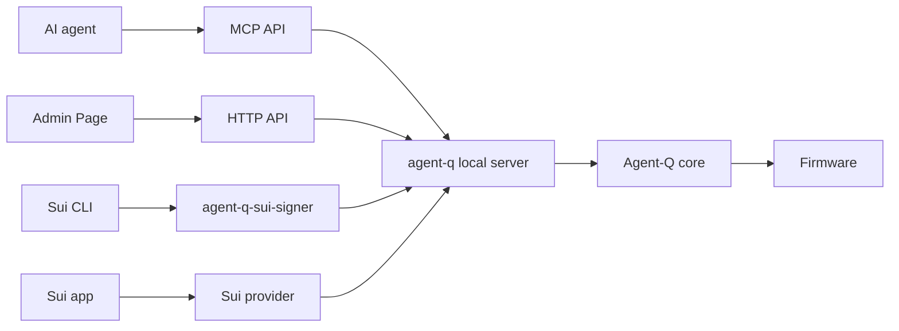

# Agent-Q

Agent-Q lets Sui CLI, MCP clients, and local apps request signatures from an
Agent-Q hardware device. The private key stays on the device. Firmware reviews
the request and produces the signature.

The agent, app, CLI, or the host process can request. The device decides.

## Who This Is For

- Sui users who want the Sui CLI to sign through an external Agent-Q device.
- Agent developers who want MCP tools for hardware-backed signing requests.
- Sui app developers who want a local Wallet Standard provider backed by an
  Agent-Q device.
- Firmware and hardware developers working on device-owned signing policy,
  local approval, and bounded signing flows.

## Quick Start

### Use With Sui CLI

Use `agent-q-sui-signer` as a Sui CLI external signer:

```sh
npx -y @stelis/agent-q
sui external-keys list-keys agent-q-sui-signer
sui external-keys add-existing "<KEY_ID>" agent-q-sui-signer
sui client switch --address <SUI_ADDRESS>
sui client transfer --object-id <OBJECT_ID> --to <TO_ADDRESS>
```

`agent-q-sui-signer` must be available on `PATH` when Sui CLI invokes it. The
same `@stelis/agent-q` package provides both `agent-q` and
`agent-q-sui-signer`.

Keep `agent-q` running while Sui CLI uses the signer. Sui CLI calls
`agent-q-sui-signer` when a transaction needs a signature. The signer calls the
local Agent-Q server, and the server sends signing requests to Firmware. The
private key stays on the device.

`agent-q-sui-signer` uses the active Sui CLI environment when it is `mainnet`,
`testnet`, `devnet`, or `localnet`. To set it explicitly:

```sh
agent-q-sui-signer configure --network testnet
```

### Use With MCP

Run the Agent-Q local server and let an MCP client call the signing tools:

```sh
npx -y @stelis/agent-q
```

Typical agent flow:

```text
scan_devices
  -> identify_devices
  -> select_device
  -> connect_device
  -> get_capabilities
  -> get_accounts
  -> sign_transaction or sign_personal_message
  -> disconnect_device
```

Agents submit requests only. They must not claim that they approved signing or
that they know the user's upstream intent. Firmware enforces state, policy,
device confirmation, signing, and cleanup.

MCP client config example:

```json
{
  "mcpServers": {
    "agent-q": {
      "command": "npx",
      "args": ["-y", "@stelis/agent-q"]
    }
  }
}
```

### Use In A Sui App

Use `@stelis/agent-q-provider-sui` to register an Agent-Q Wallet Standard wallet
from your app:

```ts
import { createAgentQSuiWalletInitializer } from "@stelis/agent-q-provider-sui/wallet-standard";
```

See `packages/example-sui-dapp-kit/` for a minimal Sui dapp-kit integration.

## Packages

| Package | Use it when you want to... |
| --- | --- |
| `@stelis/agent-q-core` | discover devices, open sessions, call the Agent-Q protocol, and parse Firmware results. |
| `@stelis/agent-q` | run the local MCP server, Admin Page, and `agent-q-sui-signer`. |
| `@stelis/agent-q-provider-sui` | connect a Sui app to an Agent-Q device through a provider / Wallet Standard adapter. |
| `packages/example-sui-dapp-kit` | run a small dapp-kit example that signs through Agent-Q. |

## How Signing Works



Current executable signing routes:

| Chain | Method | Current behavior |
| --- | --- | --- |
| `sui` | `sign_transaction` | Bounded Sui transaction signing. Firmware chooses policy or user confirmation from its device-local signing mode. |
| `sui` | `sign_personal_message` | Bounded Sui personal-message signing in user-confirmation mode. Policy mode fails closed for this method. |

Unsupported chains and unsupported methods fail explicitly. Chains are exposed
through the shared protocol; Agent-Q does not create separate chain-specific
product APIs.

## Security Basics

- The host process, MCP, Sui CLI tools, providers, apps, and agents are requesters, not
  signing authority.
- The host process does not store signing keys and does not make signing or policy
  decisions.
- Firmware stores keys and policies locally and owns signing decisions.
- Firmware chooses the signing authorization gate from device-local state.
  Requests cannot choose policy mode or user-confirmation mode.
- Agent-Q cannot verify what happened inside an agent, app, wallet UI, or host
  process before a signing request was created.
- All external requests are untrusted input. Firmware must parse bounded
  request contents before signing.

## Current Status

Detailed status lives in `docs/IMPLEMENTATION_STATUS.md`.

Current source includes the Sui signing routes listed above, MCP tools,
provider-sui, and StackChan CoreS3 Firmware paths. Tracked product status still
distinguishes implemented source paths, hardware evidence, and product-active
claims. Do not infer product-active signing support from source code alone.

Current limitations:

- Sui is the only executable chain.
- Arbitrary Sui transaction signing is not implemented.
- Sponsored Sui transactions are not implemented.
- Sui transaction execution / submit-to-network is not an Agent-Q signing
  responsibility.
- Policy-authorized personal-message signing is not implemented.
- Browser dapp signing requires the provider/browser runtime path, not the
  Node-local provider factory.

## Advanced

- Protocol contract: `specs/PROTOCOL.md`
- Security model: `docs/SECURITY_MODEL.md`
- State model: `docs/STATE_MODEL.md`
- Implementation status: `docs/IMPLEMENTATION_STATUS.md`
- Firmware overview: `firmware/README.md`
- StackChan CoreS3 target: `firmware/src/stackchan-cores3/README.md`

## Development

Install workspace dependencies:

```sh
npm install
```

Build all packages:

```sh
npm run build
```

Run the root test suite:

```sh
npm test
```

Firmware build instructions are target-specific. Start with
`firmware/README.md` and the target README under `firmware/src/<hardware-id>/`.

`.WORK/` is for local planning, scratch files, and investigation materials. It
is not tracked by Git and must not be required by user-facing build or runtime
instructions.
