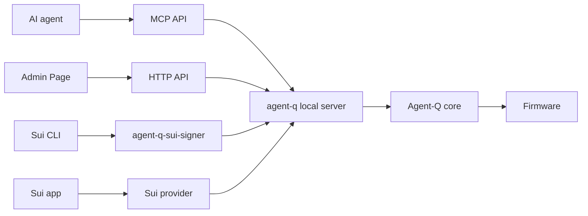

# Agent-Q

Agent-Q lets Sui CLI, MCP clients, and local apps request signatures from an
Agent-Q hardware device. The private key stays on the device. Firmware reviews
the request and produces the signature.

The agent, app, CLI, or the host process can request. The device decides.

## Terms Used Here

- **host process**: the local `agent-q` process. It exposes MCP stdio tools,
  the local HTTP API, and the Admin Page, and relays requests to Firmware.
- **Firmware**: the software running on the Agent-Q hardware device. Firmware is
  the signing and policy authority.
- **Admin Page**: the local web UI served by the host process. It is not a
  separate authority.
- **Sui CLI external signer**: an executable that Sui CLI starts from its
  keystore configuration when a registered address needs a signature. In
  Agent-Q this executable is `agent-q-sui-signer`.

## Who This Is For

- Sui users who want the Sui CLI to sign through an external Agent-Q device.
- Agent developers who want MCP tools for hardware-backed signing requests.
- Sui app developers who want a local Wallet Standard provider backed by an
  Agent-Q device.
- Firmware and hardware developers working on device-owned signing policy,
  local approval, and bounded signing flows.

## Quick Start

### Use With Sui CLI

Use `agent-q-sui-signer` as a Sui CLI external signer. Sui CLI needs a
one-time external key registration before normal `sui client ...` commands can
use Agent-Q. Running the Agent-Q server only opens the local server and requests
a device connection; it does not register the key in Sui CLI.

Start the local Agent-Q server and confirm the connection request on the
device. With a global install:

```sh
npm install -g @stelis/agent-q
agent-q serve --request-connect
```

Without a global install:

```sh
npm exec --yes --package @stelis/agent-q -- agent-q serve --request-connect
```

After approval, the server writes an operator-facing summary to stderr. The
summary includes the connected device id, public Sui address when available,
Firmware-reported signing mode when available, and supported signing methods
when available. Account information and capability information are read after
the device approves the connection; if either read fails, the server prints a
separate `Agent-Q accounts unavailable: ...` or
`Agent-Q capabilities unavailable: ...` line. Use the public Sui address from
this summary as `<SUI_ADDRESS>` in the Sui CLI commands below.

In another terminal, register the Agent-Q key with Sui CLI once. This writes an
external signer entry to the Sui CLI keystore; it is not an environment
variable. Copy `<KEY_ID_FROM_LIST_KEYS>` from the `list-keys` output:

```sh
sui external-keys list-keys agent-q-sui-signer
sui external-keys add-existing "<KEY_ID_FROM_LIST_KEYS>" agent-q-sui-signer
sui client switch --address <SUI_ADDRESS>
```

After registration, keep `agent-q` running and use the registered address as the
Sui CLI sender:

```sh
sui client gas <SUI_ADDRESS> --json
sui client pay-sui \
  --input-coins <SUI_COIN_OBJECT_ID> \
  --recipients <TO_ADDRESS> \
  --amounts <MIST_AMOUNT> \
  --gas-budget <GAS_BUDGET> \
  --sender <SUI_ADDRESS> \
  --json
```

The server can request a connection, but only Firmware can approve it on the
device. Sui CLI finds the external signer from its keystore registration for the
sender address, then runs `agent-q-sui-signer` by command name. The signer must
therefore be installed, linked, or otherwise available on `PATH` whenever Sui
CLI invokes it.

If you do not install the package globally, run both setup and Sui CLI commands
through `npm exec` so `agent-q-sui-signer` is on `PATH` for that command:

```sh
npm exec --yes --package @stelis/agent-q -- \
  sui external-keys list-keys agent-q-sui-signer
npm exec --yes --package @stelis/agent-q -- \
  sui external-keys add-existing "<KEY_ID_FROM_LIST_KEYS>" agent-q-sui-signer
```

Use the same `npm exec --yes --package @stelis/agent-q -- ...` wrapper for
subsequent `sui client ...` commands when the package is not globally installed.

Keep `agent-q` running while Sui CLI uses the signer. Sui CLI calls
`agent-q-sui-signer` when a transaction needs a signature. The signer calls the
local Agent-Q server, and the server sends signing requests to Firmware. The
private key stays on the device.

`agent-q-sui-signer` uses the active Sui CLI environment when it is `mainnet`,
`testnet`, `devnet`, or `localnet`. To set it explicitly:

```sh
agent-q-sui-signer configure --network testnet
```

### Use With MCP

Run the Agent-Q local server and let an MCP client call the signing tools:

```sh
npx -y @stelis/agent-q serve --request-connect
```

Confirm the connection request on the device. After approval, `agent-q` writes
an operator-facing summary to stderr. The summary includes the connected device
id, public Sui address when available, Firmware-reported signing mode when
available, and supported signing methods when available. Account information
and capability information are read after the device approves the connection;
if either read fails, the server prints a separate
`Agent-Q accounts unavailable: ...` or
`Agent-Q capabilities unavailable: ...` line. This is diagnostic output only;
it does not register the key with Sui CLI and does not authorize signing.

After approval, MCP tools can use the active session. Signing requests still
require the Firmware-owned signing gate for the selected method and device mode.

Typical agent flow:

```text
scan_devices
  -> identify_devices
  -> select_device
  -> connect_device
  -> get_capabilities
  -> get_accounts
  -> sign_transaction or sign_personal_message
  -> disconnect_device
```

Agents submit requests only. They must not claim that they approved signing or
that they know the user's upstream intent. Firmware enforces state, policy,
device confirmation, signing, and cleanup.

MCP client config example:

```json
{
  "mcpServers": {
    "agent-q": {
      "command": "npx",
      "args": ["-y", "@stelis/agent-q", "serve", "--request-connect"]
    }
  }
}
```

### Use In A Sui App

Use `@stelis/agent-q-provider-sui` to register an Agent-Q Wallet Standard wallet
from your app:

```ts
import { createAgentQSuiWalletInitializer } from "@stelis/agent-q-provider-sui/wallet-standard";
```

See `packages/example-sui-dapp-kit/` for a minimal Sui dapp-kit integration.

## Packages

| Package | Use it when you want to... |
| --- | --- |
| `@stelis/agent-q-core` | discover devices, open sessions, call the Agent-Q protocol, and parse Firmware results. |
| `@stelis/agent-q` | run the local MCP server, Admin Page, and `agent-q-sui-signer`. |
| `@stelis/agent-q-provider-sui` | connect a Sui app to an Agent-Q device through a provider / Wallet Standard adapter. |
| `packages/example-sui-dapp-kit` | run a small dapp-kit example that signs through Agent-Q. |

## How Signing Works



Current signing routes in source, with product-active evidence tracked in
`docs/IMPLEMENTATION_STATUS.md`:

| Chain | Method | Current behavior |
| --- | --- | --- |
| `sui` | `sign_transaction` | Sui transaction signing over inline or same-session staged bytes. Firmware parses bounded offline `TransactionData::V1 -> ProgrammableTransaction` facts, then chooses policy authorization or user authorization from its device-local signing mode. Policy authorization currently rejects valid transactions whose policy coverage is incomplete and does not sign until complete policy coverage and accepted sign-rule validation are implemented. User authorization shows covered offline facts when offline facts review coverage is complete, or a device-local blind-signing warning when Firmware can validate and bind the transaction but offline facts review coverage is incomplete. |
| `sui` | `sign_personal_message` | Bounded Sui personal-message signing in user authorization mode. Policy authorization mode fails closed for this method. |

Unsupported chains and unsupported methods fail explicitly. Chains are exposed
through the shared protocol; Agent-Q does not create separate chain-specific
product APIs.

## Security Basics

- The host process, MCP, Sui CLI tools, providers, apps, and agents are requesters, not
  signing authority.
- The host process does not store signing keys and does not make signing or policy
  decisions.
- Firmware stores keys and policies locally and owns signing decisions.
- Firmware chooses the signing authorization gate from device-local state.
  Requests cannot choose policy authorization mode or user authorization mode.
- Agent-Q cannot verify what happened inside an agent, app, wallet UI, or host
  process before a signing request was created.
- All external requests are untrusted input. Firmware must parse bounded
  request contents before signing.

## Current Status

Detailed status lives in `docs/IMPLEMENTATION_STATUS.md`.

Current source includes the Sui signing routes listed above, MCP tools,
provider-sui, and StackChan CoreS3 Firmware paths. Product-active signing
support is not claimed unless `docs/IMPLEMENTATION_STATUS.md` says the matching
source, docs, tests, build, hardware, and visual evidence are complete.

Current limitations:

- Sui is the only executable chain.
- Sui transaction parsing is bounded and offline. Parser facts may be available
  for broader programmable transactions, but parser success is not signing
  authorization. Firmware user mode shows a covered offline facts review when
  offline facts review coverage is complete and otherwise shows a blind-signing
  warning for valid, account-bound transactions whose offline facts review
  coverage is incomplete. Firmware policy mode returns a policy rejection for
  valid transactions whose policy coverage is incomplete
  and does not sign until policy coverage is complete for the parsed shape.
  Agent-Q does not simulate Sui execution or fetch chain state.
- Sponsored Sui transactions are not implemented.
- Sui transaction execution / submit-to-network is not an Agent-Q signing
  responsibility.
- Policy-authorized personal-message signing is not implemented.
- Browser dapp signing requires the provider/browser runtime path, not the
  Node-local provider factory.

## Advanced

- Protocol contract: `specs/PROTOCOL.md`
- Security model: `docs/SECURITY_MODEL.md`
- State model: `docs/STATE_MODEL.md`
- Implementation status: `docs/IMPLEMENTATION_STATUS.md`
- Firmware overview: `firmware/README.md`
- StackChan CoreS3 target: `firmware/src/stackchan-cores3/README.md`

## Development

Install workspace dependencies:

```sh
npm install
```

Build all packages:

```sh
npm run build
```

Run the root test suite:

```sh
npm test
```

Firmware build instructions are target-specific. Start with
`firmware/README.md` and the target README under `firmware/src/<hardware-id>/`.

`.WORK/` is for local planning, scratch files, and investigation materials. It
is not tracked by Git and must not be required by user-facing build or runtime
instructions.
