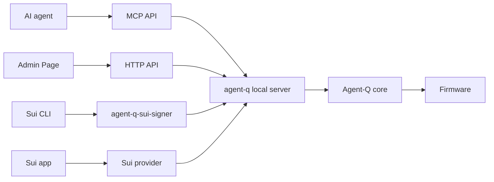

# Agent-Q

> Development status: Agent-Q is an active development project with
> hardware-tested Sui signing paths for CLI, MCP, and supported provider flows.
> The current StackChan CoreS3 Firmware path uses DEV_PROFILE material intended
> for development and demos, not real-asset custody. See Current Status for
> storage and profile limitations.

## Concept

Agent-Q separates execution surfaces from signing authority.

Execution capability is not signing authority. Agent-Q keeps that boundary
explicit for agent-driven and local Sui signing flows.

This README describes the Agent-Q authority-boundary architecture for local Sui
signing flows. Current implementation status and profile limitations are tracked
in `docs/IMPLEMENTATION_STATUS.md`.

MCP clients, Sui CLI, and supported Sui app adapters submit bounded requests
through the local `agent-q` host process. AI agent runtimes usually reach
Agent-Q through MCP clients. The host relays requests; it does not store
signing material, decide policy, or approve signing.

Agent-Q Firmware runs on a separate signing device. It holds signing material
and policy for the implemented material profile, checks device state and request
contents, applies the implemented policy or device-local approval gate, and
returns signed results or explicit failures.

Signing request transport stays local. Signing authority stays on the device.
Requesters can ask for signatures, but they cannot hold signing material,
choose the authorization mode, or approve their own requests.

## Structure

Agent-Q has three roles:

- **requesters** create signing, account, policy read, policy proposal
  submission, or status requests. MCP clients, Sui CLI, Sui app adapters, and
  the Admin Page are request surfaces, not signing authorities.
- the **host process** is the local `agent-q` process. It exposes MCP stdio
  tools, the local HTTP API, the Admin Page, and adapter-facing request
  surfaces, then relays bounded requests to Firmware.
- **Agent-Q Firmware** is the software running on the signing device. Firmware
  owns policy checks, device-local approval gates, signing, persistence, and
  cleanup, and holds signing material for the implemented material profile.

Agent-Q uses a simple authority model:

- requesters create requests;
- the host process relays requests;
- Firmware handles each implemented request type according to device-local
  state.

For signing requests, Firmware decides whether the implemented policy or
device-local approval gate permits signing.

Unsupported chains and methods fail explicitly.

## Use Agent-Q

- Sui users can register `agent-q-sui-signer` as a Sui CLI external signer.
  See `packages/agent-q/README.md`.
- MCP clients can run the local server and call Agent-Q MCP tools. See
  `packages/agent-q/README.md`.
- Sui app developers can use the Sui provider package for supported Wallet
  Standard adapter flows. See `packages/provider-sui/README.md` and
  `packages/sample-sui-dapp-kit/README.md`.
- Sui zkLogin browser setup and sign-only transaction checks live in the
  non-production test web sample. See
  `packages/sample-zklogin-test-web/README.md`.
- Firmware and hardware developers working on device-owned signing policy,
  local approval, and bounded signing flows should start with `firmware/README.md`.

## Packages

| Package | Use it when you want to... |
| --- | --- |
| `@stelis/agent-q-core` | discover devices, open sessions, call the Agent-Q protocol, and parse Firmware results. |
| `@stelis/agent-q` | run the local MCP server, Admin Page, and `agent-q-sui-signer`. |
| `@stelis/agent-q-provider-sui` | connect a Sui app to an Agent-Q device through a provider / Wallet Standard adapter. |
| `packages/sample-sui-dapp-kit` | run a small dapp-kit sample that signs through Agent-Q. |
| `packages/sample-zklogin-test-web` | run a non-production browser test tool for Sui zkLogin proof preparation/proposal and sign-only transaction checks through the Agent-Q browser provider over Web Serial. |

## Current Implementation Highlights

The current implementation includes these device-owned paths. They are
development/demo capabilities; Current Status below defines the DEV_PROFILE and
product-active limits.

- **Device-local BIP-39 setup**: Firmware can generate a new 12-word BIP-39
  backup phrase on the device, display it for backup, and store DEV_PROFILE root
  entropy only after local backup confirmation and repeated local PIN entry.
- **Device-local mnemonic restore**: Firmware can accept a 12-word BIP-39
  import through the device UI, verify the checksum, and enter the same local
  PIN setup path. USB, host process, and MCP mnemonic import are not
  implemented.
- **Sui zkLogin active identity**: the browser test flow can prepare and propose
  bounded zkLogin proof material through the provider/Web Serial path. Firmware
  reviews the proposal on device, requires local PIN approval, stores one
  bounded proof record, and projects the active zkLogin Sui account. When
  zkLogin is active, the same signing request path produces a zkLogin signature
  envelope after the normal Firmware authorization gate. Firmware stores no raw
  JWT.
- **Large Sui transaction payloads**: `sign_transaction` supports inline
  `txBytes` and same-session staged payload delivery for larger Sui transaction
  bytes, up to the Sui serialized transaction maximum. This is a payload and
  adapter input capacity, not a claim that every Sui transaction shape is
  semantically signable; unsupported or unbindable shapes fail before signing.
- **Sui sponsored transaction receive path**: Firmware has a device-local Sui
  account setting that controls whether it accepts transactions where the parsed
  sender is the active account and the parsed gas owner is a different sponsor.
  When accepted, Agent-Q still returns only the active sender's signature;
  sponsor signature collection and transaction execution assembly are outside
  Agent-Q.

## Request Flow



Current signing routes are summarized below. In this README, `product-active`
means the matching source, docs, tests, build, current-tree target hardware
evidence, and visual evidence are complete in `docs/IMPLEMENTATION_STATUS.md`.
A route can be implemented and hardware-tested while product-active evidence is
still being completed.

| Chain | Method | Current behavior |
| --- | --- | --- |
| `sui` | `sign_transaction` | Current implementation supports inline or same-session staged Sui transaction bytes. It validates the request, parses bounded offline transaction facts when available, applies the device-local policy or user authorization gate, and produces a signature response only after that gate authorizes signing. The parsed sender must match the active account; the parsed gas owner must also match unless the active account's device-local Sui account setting accepts gas sponsors. Policy mode fails closed when required policy coverage is missing, incomplete, unmatched, or reject-matched. User mode shows covered offline facts when available; otherwise it shows a device-local blind-signing warning for a valid transaction bound to the active account. Blind signing means confirming signable bytes whose transaction details are not fully reviewable from offline facts. |
| `sui` | `sign_personal_message` | Current implementation supports bounded Sui personal-message signing in user authorization mode. Policy authorization mode fails closed for this method. |

The current implementation contains Sui zkLogin active identity paths, but
`docs/IMPLEMENTATION_STATUS.md` does not mark them product-active. The sample
test web exercises browser-to-device proof setup and sign-only transaction
checks over Web Serial. Enoki, OAuth, prover work, and Google OAuth testnet
setup stay in the browser test layer; Agent-Q receives only bounded proof
proposals. The sample does not display JWTs or proof JSON and does not write
them to browser storage.

Unsupported chains and unsupported methods fail explicitly. Chains are exposed
through the shared protocol; Agent-Q does not create separate chain-specific
product APIs.

## Authority Boundary Basics

This section explains who may request work and who may decide. DEV_PROFILE
storage and product-active status are covered in Current Status.

- The host process, MCP, Sui CLI tools, providers, apps, and agents are
  requesters, not signing authority.
- The host process does not store signing material and does not make signing or
  policy decisions.
- Firmware holds signing material and policy for the implemented material profile
  and owns signing decisions.
- Firmware chooses the signing authorization gate from device-local state.
  Requests cannot choose policy authorization mode or user authorization mode.
- Agent-Q cannot verify what happened inside an agent, app, wallet UI, or host
  process before a signing request was created.
- All external requests are untrusted input. Firmware must parse bounded
  request contents before signing.

## Current Status

Detailed status lives in `docs/IMPLEMENTATION_STATUS.md`.

Current implementation includes the Sui signing routes listed above, MCP tools,
provider-sui, and StackChan CoreS3 Firmware paths. Hardware smoke coverage is
recorded in `docs/IMPLEMENTATION_STATUS.md`; product-active signing support is
claimed only when the matching status row says the source, docs, tests, build,
hardware, and visual evidence are complete.

Current limitations:

- The current StackChan CoreS3 Firmware path uses DEV_PROFILE material intended
  for development and demos, not real-asset custody.
- In DEV_PROFILE, root entropy, the active policy record, and the local PIN
  verifier are stored in ordinary NVS. Secure Boot, Flash Encryption, and NVS
  Encryption are not configured.
- DEV_PROFILE is the only implemented material profile.
- Sui is the only executable chain.
- Sui transaction parsing is bounded and offline. Agent-Q does not simulate Sui
  execution or fetch chain state.
- Sui sponsored transaction support is limited to the sender-bound receive path
  described above. Agent-Q does not produce, collect, or assemble sponsor
  signatures and does not execute or submit Sui transactions.
- Policy-authorized personal-message signing is not implemented.
- Sui zkLogin browser-to-device setup, clear, reconnect, and signing paths are
  not product-active.
- Browser dapp signing requires the provider/browser runtime path, not the
  Node-local provider factory.

## Advanced

- Protocol contract: `specs/PROTOCOL.md`
- Security model: `docs/SECURITY_MODEL.md`
- State model: `docs/STATE_MODEL.md`
- Current policy schema and Sui policy facts: `docs/POLICY_SCHEMA.md`
- Implementation status: `docs/IMPLEMENTATION_STATUS.md`
- Firmware overview: `firmware/README.md`
- StackChan CoreS3 target: `firmware/src/stackchan-cores3/README.md`

## Development

Install workspace dependencies:

```sh
npm install
```

Build all packages:

```sh
npm run build
```

Run the root test suite:

```sh
npm test
```

Firmware build instructions are target-specific. Start with
`firmware/README.md` and the target README under `firmware/src/<hardware-id>/`.

`.WORK/` is for local planning, scratch files, and investigation materials. It
is not tracked by Git and must not be required by user-facing build or runtime
instructions.
