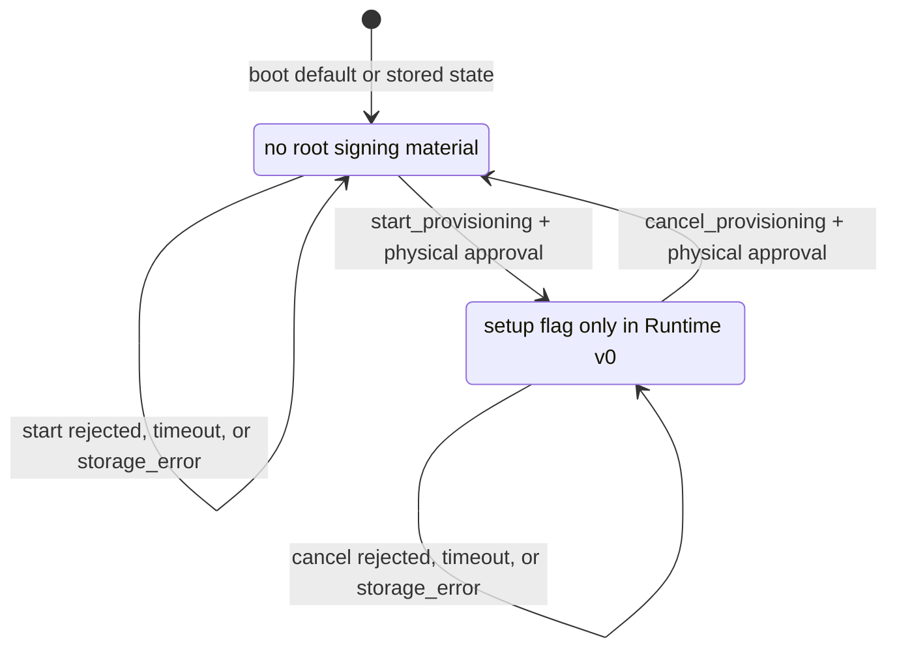

# Agent-Q Provisioning Flow

This document defines the target first-install flow for Agent-Q signing
material.

This is target design, not implemented behavior. Current implementation status
lives in `docs/IMPLEMENTATION_STATUS.md`.

## Purpose

Provisioning creates or imports the root signing material for a device. Firmware
then derives chain accounts from that material.

Provisioning is not a normal MCP signing path. Agent-facing MCP tools must not
create, import, export, display, or reset signing material.

## Security Rules

- Firmware owns signing material.
- Gateway must not store mnemonics, seeds, private keys, or imported signing
  material.
- MCP clients must not receive mnemonics, seeds, private keys, or imported
  signing material.
- Firmware must not expose an export API after provisioning.
- Chain accounts expose only public keys and addresses.
- USER_PROFILE signing material is generated or imported only after firmware
  integrity protections are active.

USER_PROFILE firmware integrity requirements are defined in
`docs/SECURITY_MODEL.md`.

## Entry Points

Provisioning can start only from:

1. First install on an unprovisioned device.
2. Explicit reprovisioning or factory reset.

Reprovisioning is destructive. It wipes signing material, accounts, policy, and
replay state before creating or importing new signing material.

## Setup Paths

### Create New Mnemonic

Preferred path:

```text
device RNG
  -> generate mnemonic / root seed inside Firmware
  -> show mnemonic to user once
  -> user backs it up
  -> user confirms backup
  -> Firmware stores root material locally
  -> Firmware exposes only public keys / addresses
```

Rules:

- The host never receives the root mnemonic or seed.
- The mnemonic is shown only during provisioning.
- After confirmation, the mnemonic is not shown again.
- If setup is canceled, Firmware wipes the generated material.

### Import Existing Mnemonic

Recovery or migration path:

```text
user provides mnemonic
  -> Firmware validates it
  -> Firmware stores root material locally
  -> Firmware exposes only public keys / addresses
```

Direct device input is preferred when hardware supports it. Host-assisted input
is weaker because the host sees the root secret, and must be labeled as such.

## Hardware Capability

Provisioning UX depends on hardware:

- Display + touch/keyboard: can support local generation, backup confirmation,
  and possibly local import.
- Display only: can show a generated mnemonic; import may need host assistance.
- Button-only or LED-only: cannot safely show or enter mnemonics; setup needs a
  weaker assisted flow or external secure setup tooling.

StackChan CoreS3 has display and touch hardware, but local mnemonic generation,
backup confirmation, and mnemonic entry are not implemented.

## Chain Accounts

The root mnemonic or seed is chain-neutral. Chain adapters own their derivation
path, signing scheme, address calculation, and public key format.

Initial target chains:

- Sui
- EVM
- Solana

Rules:

- Gateway must not derive private keys.
- Firmware returns public key/address data through `get_accounts`.
- Signing uses `call_method`.
- Agent-Q must not add chain-specific top-level MCP tools.

The first implementation target is Sui Ed25519.

## Firmware State

Target provisioning states:

- `unprovisioned`: no root signing material is stored.
- `provisioning`: setup flow is active.
- `provisioned`: root signing material exists.
- `locked`: sensitive actions require local unlock.

Runtime v0 implements only the state flag for `unprovisioned` and
`provisioning` on the StackChan CoreS3 target. It loads the state from
device-local storage, reports it through `get_status`, and changes it through
physical approval for `start_provisioning` and `cancel_provisioning`.

Runtime v0 does not generate, import, store, export, or derive from root signing
material. Firmware must not set `provisioned` until root signing material
exists. Firmware must not set `locked` until an unlock model exists.

Runtime v0 state transitions:



`start_provisioning` is valid only from `unprovisioned`. `cancel_provisioning`
is valid only from `provisioning`. Invalid transitions return `invalid_state`
without opening approval UI.

## Implementation Order

Recommended first slice:

1. Report whether a device is provisioned.
2. Store provisioning state without real mnemonic material.
3. Add setup-step messages that still store no real assets.
4. Add real BIP-39 generation only after storage, wipe, UI, and verification
   paths are specified and tested.
5. Add Sui Ed25519 account derivation.
6. Add `get_accounts`.
7. Add Sui `sign_personal_message`.

Do not jump directly from mnemonic generation to user transaction signing.

Current implementation status: steps 1 and 2 are implemented only as
provisioning state reporting and approved state start/cancel. Step 3 and later
are not implemented.

## Completion Criteria

Provisioning is complete only when:

- Firmware distinguishes unprovisioned and provisioned devices.
- New mnemonic generation happens on the device.
- Import is clearly separated from generation.
- Host-assisted import is labeled weaker than device generation.
- Generated material is wiped on cancel.
- Confirmed material is stored only in Firmware local storage.
- Export is unavailable after provisioning.
- Gateway receives only public key/address data.
- DEV_PROFILE and USER_PROFILE setup are documented separately.
