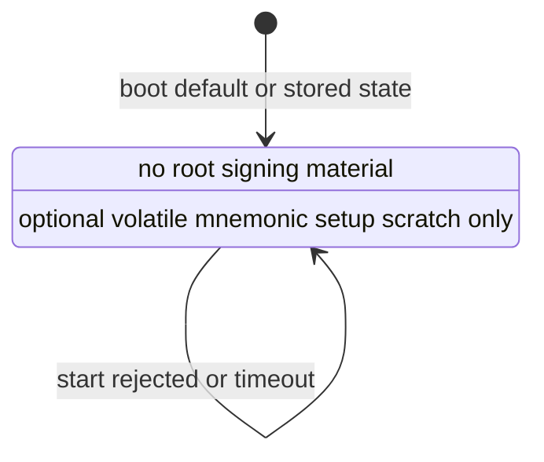

# Agent-Q Provisioning Flow

This document defines the target first-install flow for Agent-Q signing
material.

This document separates target design from implemented setup slices. Current
implementation status lives in `docs/IMPLEMENTATION_STATUS.md`.

## Purpose

Provisioning creates or imports the root signing material for a device. Firmware
then derives chain accounts from that material.

Provisioning is not a normal MCP signing path. Agent-facing MCP tools must not
create, import, export, display, or reset signing material.

## Security Rules

- Firmware owns signing material.
- Gateway must not store mnemonics, seeds, private keys, or imported signing
  material.
- MCP clients must not receive mnemonics, seeds, private keys, or imported
  signing material.
- Firmware must not expose an export API after provisioning.
- Chain accounts expose only public keys and addresses.
- USER_PROFILE signing material is generated or imported only after firmware
  integrity protections are active.

USER_PROFILE firmware integrity requirements are defined in
`docs/SECURITY_MODEL.md`.

## Entry Points

Provisioning can start only from:

1. First install on an unprovisioned device.
2. Explicit reprovisioning or factory reset.

Reprovisioning is destructive. It wipes signing material, accounts, policy, and
replay state before creating or importing new signing material.

## Setup Paths

### Create New Mnemonic

Preferred path:

```text
device RNG
  -> generate mnemonic / root seed inside Firmware
  -> show mnemonic to user once
  -> user backs it up
  -> user confirms backup
  -> Firmware stores root material locally
  -> Firmware exposes only public keys / addresses
```

Rules:

- The host never receives the root mnemonic or seed.
- The mnemonic is shown only during provisioning.
- After confirmation, the mnemonic is not shown again.
- If setup is canceled, Firmware wipes the generated material.

### Import Existing Mnemonic

Recovery or migration path:

```text
user provides mnemonic
  -> Firmware validates it
  -> Firmware stores root material locally
  -> Firmware exposes only public keys / addresses
```

Direct device input is preferred when hardware supports it. Host-assisted input
is weaker because the host sees the root secret, and must be labeled as such.

## Hardware Capability

Provisioning UX depends on hardware:

- Display + touch/keyboard: can support local generation, backup confirmation,
  and possibly local import.
- Display only: can show a generated mnemonic; import may need host assistance.
- Button-only or LED-only: cannot safely show or enter mnemonics; setup needs a
  weaker assisted flow or external secure setup tooling.

StackChan CoreS3 has display and touch hardware. Source-level DEV_PROFILE
recovery phrase generation and volatile backup confirmation are implemented as
setup scaffolding. Hardware smoke is still pending.
Mnemonic import, persistent root storage, account derivation, and signing are
not implemented.

## Chain Accounts

The root mnemonic or seed is chain-neutral. Chain adapters own their derivation
path, signing scheme, address calculation, and public key format.

Initial target chains:

- Sui
- EVM
- Solana

Rules:

- Gateway must not derive private keys.
- Firmware returns public key/address data through `get_accounts`.
- Signing uses `call_method`.
- Agent-Q must not add chain-specific top-level MCP tools.

The first implementation target is Sui Ed25519.

## Firmware State

Target provisioning states:

- `unprovisioned`: no root signing material is stored.
- `provisioning`: setup flow is active.
- `provisioned`: root signing material exists.
- `locked`: sensitive actions require local unlock.

Runtime v0 implements the current StackChan CoreS3 mnemonic UI flow while
keeping the persistent state `unprovisioned`. It loads and reports
`provisioning.state`, but this slice does not persist `provisioning`, does not
store root material, and does not move to `provisioned`.

Runtime v0 does not import, persist, export, or derive from root signing
material. Current StackChan CoreS3 source can generate a BIP-39 recovery phrase
only as RAM scratch, display its up-to-4-letter word prefixes on device in a
3-column by 4-row grid, and wipe scratch on confirm, cancel, timeout, failure,
or display expiry. Three-letter BIP-39 words are displayed as the full word.
This is DEV_PROFILE scaffolding and is not USER_PROFILE key
provisioning. Firmware must not set `provisioned` until root signing material
exists in device-local storage. Firmware must not set `locked` until an unlock
model exists.

Runtime v0 state transitions:



`start_provisioning` is valid only when persistent state is `unprovisioned` and
no mnemonic setup scratch is active. `cancel_provisioning` is valid only while
mnemonic setup scratch or its confirmation prompt is active. Invalid transitions
return `invalid_state` without opening approval UI.

## Recovery Phrase Setup v0

Current StackChan CoreS3 source enters recovery phrase setup through approved
`start_provisioning` or through the local setup speech bubble shown while the device is
`unprovisioned`, then finishes through `confirm_recovery_phrase_backup` or
`cancel_provisioning`. Protocol requests require physical approval on the device
and do not require `sessionId`; the local setup speech bubble touch is already a physical
device action.

Approved `start_provisioning` generates a 12-word BIP-39 recovery phrase from
an Agent-Q CSPRNG seeded from early boot entropy before HAL initialization and
BIP-39 checksum logic. Firmware stores the phrase only in RAM and displays only
the up-to-4-letter word prefixes on the device. Three-letter BIP-39 words are
displayed as the full word. The prefixes are shown as 12 numbered cells in 3
columns by 4 rows so they fit on one StackChan CoreS3 screen. BIP-39 English
word prefixes identify the words and are secret material; Gateway never
receives them. The response reports only `recovery_phrase_result` with status
`displayed` and `provisioning.state = unprovisioned`. The response never
carries the phrase, prefixes, entropy, seed, private key, account data, or
policy data.

Firmware tracks the volatile recovery phrase with an explicit scratch substate:
`none`, `displayed`, or `backup_confirmation_pending`. This RAM-only substate is
separate from the persistent `provisioning.state`, pending approval state, and
LVGL panel state. The UI is not the source of truth; panel deletion or
replacement is treated as an event that must move `displayed` to `none` by
wiping or invalidating the phrase.

`confirm_recovery_phrase_backup` is accepted only after a phrase has been
displayed. Accepting the request moves the scratch substate from `displayed` to
`backup_confirmation_pending`; approval, rejection, or timeout always wipes the
volatile phrase and returns the scratch substate to `none`. In this v0 slice,
approval leaves the device `unprovisioned`; it does not persist root material
and does not move to `provisioned`. Rejection or timeout also wipes the volatile
phrase, so the user must generate a new phrase to continue.

The recovery phrase is backup-ready only while its device display is still the
active setup UI. If that display is removed or replaced, Firmware wipes or
invalidates the volatile phrase so a later backup confirmation cannot confirm
material that is no longer visible. The active physical backup-confirmation
prompt is the only exception: it may replace the phrase display after validating
that the phrase was visible, but it must end by wiping the phrase whether the
user confirms, rejects, or lets the prompt time out.

While the phrase display is active, `get_status` remains available and reports
`device.state = busy`. The display has a finite lifetime; expiry clears the
setup panel and wipes the volatile phrase.

`cancel_provisioning` also wipes volatile setup scratch once its approval UI has
interrupted a recovery phrase display. If the user rejects cancellation or the
cancel approval times out, the persistent state remains `unprovisioned`, but
the displayed phrase is gone and must not be treated as recoverable.

This v0 flow deliberately stops before USER_PROFILE key storage. Real user
signing material remains blocked by the security-profile gates in
`docs/SECURITY_MODEL.md`: secure firmware profile, encrypted storage, verified
RNG readiness, destructive hardware rehearsal, and hardware smoke.

## Implementation Order

Recommended first slice:

1. Report whether a device is provisioned.
2. Add setup-step messages that still store no persistent assets.
3. Add DEV_PROFILE BIP-39 recovery phrase display with volatile wipe and no
   host exposure.
4. Add USER_PROFILE storage and backup confirmation only after the secure
   profile gates pass.
5. Add Sui Ed25519 account derivation.
6. Add `get_accounts`.
7. Add Sui `sign_personal_message`.

Do not jump directly from mnemonic generation to user transaction signing.

Current implementation status: step 1 is implemented as provisioning status
reporting without signing readiness. Step 2 is implemented as the current
StackChan CoreS3 mnemonic UI source plus Gateway protocol parsing; hardware
smoke is still required. Mnemonic import, persistent root storage, account
derivation, and signing APIs are not implemented.

## Completion Criteria

Provisioning is complete only when:

- Firmware distinguishes unprovisioned and provisioned devices.
- New mnemonic generation happens on the device.
- Import is clearly separated from generation.
- Host-assisted import is labeled weaker than device generation.
- Generated material is wiped on cancel.
- Confirmed material is stored only in Firmware local storage.
- Export is unavailable after provisioning.
- Gateway receives only public key/address data.
- DEV_PROFILE and USER_PROFILE setup are documented separately.
