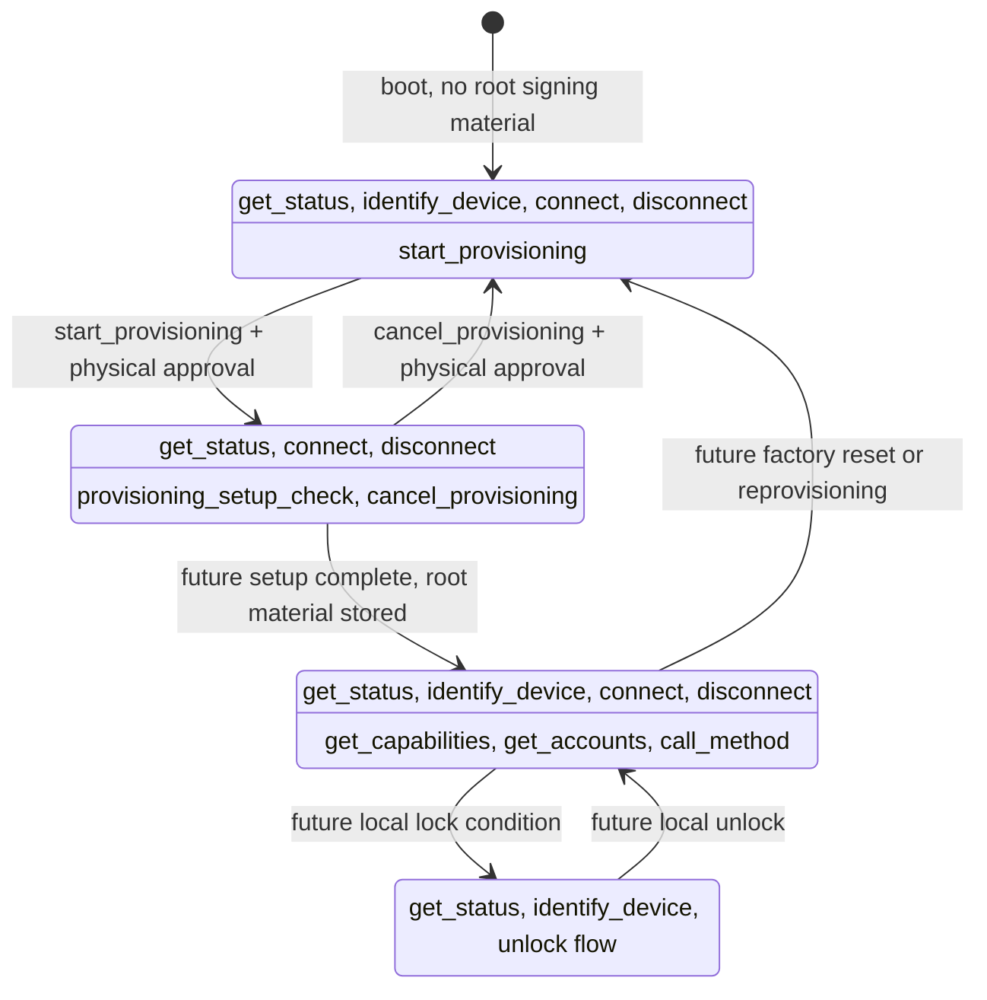
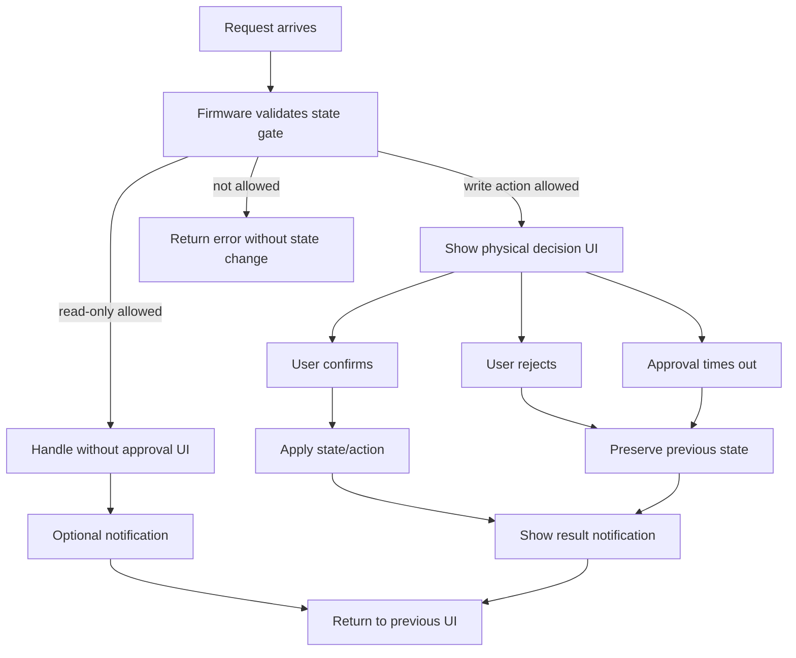

# Agent-Q State Model

This document defines Agent-Q product states, allowed protocol functions, and
module responsibility boundaries.

It is a design contract for current and future implementation. Current
implementation status lives in `docs/IMPLEMENTATION_STATUS.md`. The wire message
contract lives in `specs/PROTOCOL.md`.

## Source Of Truth

State names are defined by:

- `specs/PROTOCOL.md`
- `products/gateway/src/safe-text.ts`

Gateway wire validation is implemented in:

- `products/gateway/src/protocol.ts`

Firmware owns state storage, state transitions, state gates, physical approval,
policy evaluation, and signing decisions.

Gateway may cache and display Firmware-reported state. Gateway must not treat a
state as signing readiness and must not decide whether signing is safe.

## Product State Diagram

This diagram shows product state, not UI state. Firmware owns these transitions.
Gateway, MCP clients, and Admin Page requests may ask for transitions, but they
are not authority.



Current implementation only persists and transitions between `unprovisioned`
and `provisioning`. The `provisioned` and `locked` states are design targets and
must not be reported until their required storage and unlock models exist.

## Product States

### `unprovisioned`

No root signing material is stored.

Allowed:

- `get_status`
- `identify_device`
- `connect`
- `disconnect`
- `start_provisioning`

Rejected:

- `get_capabilities`
- `get_accounts`
- `call_method`
- policy read/write
- signing
- external evidence or price fetch

`connect` may establish a communication session, but it is not signing
permission.

### `provisioning`

Local setup is active.

Allowed:

- `get_status`
- `identify_device` only when it does not disrupt setup UI
- `connect`
- `disconnect`
- `provisioning_setup_check` setup-step message
- `cancel_provisioning`

Rejected:

- `get_capabilities`
- `get_accounts`
- `call_method`
- policy read/write
- signing
- external evidence or price fetch

Scratch signing material may exist only inside Firmware during future setup
steps. Canceling setup must wipe scratch material before returning to
`unprovisioned`.

### `provisioned`

Root signing material exists.

Allowed:

- `get_status`
- `identify_device`
- `connect`
- `disconnect`
- `get_capabilities`
- `get_accounts`
- `call_method`
- policy read/update according to Firmware policy-update authorization

This state is not blanket signing approval. Policy still decides whether each
request signs, rejects, or asks.

### `locked`

Sensitive actions require local unlock.

Allowed:

- `get_status`
- `identify_device`
- unlock flow

Rejected until unlocked:

- `get_accounts`
- `call_method`
- policy update
- signing

This state is reserved until an unlock model is implemented.

## API / State Matrix

| Function | `unprovisioned` | `provisioning` | `provisioned` | `locked` | Owner |
|---|---:|---:|---:|---:|---|
| `get_status` | O | O | O | O | Firmware |
| `identify_device` | O | O* | O | O | Firmware |
| `connect` | O | O | O | TBD | Firmware |
| `disconnect` | O | O | O | O | Firmware |
| `start_provisioning` | O | X | X | X | Firmware |
| `cancel_provisioning` | X | O | X | X | Firmware |
| `provisioning_setup_check` | X | O | X | X | Firmware |
| `get_capabilities` | X | X | O | X | Firmware |
| `get_accounts` | X | X | O | X | Firmware |
| `call_method` | X | X | O | X | Firmware |
| policy read | X | X | O | X | Firmware |
| policy update | X | X | O, with authorization | X | Firmware |

`O*`: allowed only when it does not disrupt setup UI.

Gateway may hide unavailable operations, but Firmware must still reject them.

## Boot Flows

First install:

```text
Boot
-> load provisioning state
-> no root signing material
-> unprovisioned
-> welcome
-> start setup
-> provisioning
-> generate mnemonic on device
-> show mnemonic once
-> user confirms backup
-> store root material
-> provisioned
-> ready
```

Reboot after provisioning:

```text
Boot
-> load provisioning state
-> verify root signing material exists
-> provisioned
-> welcome
-> ready
```

If stored state and signing material disagree, Firmware must fail closed rather
than pretending signing is ready.

## UI State

UI state is not product state. UI only represents product state or a temporary
request.

Common UI states:

- welcome
- idle avatar
- mnemonic display
- notification
- decision prompt
- result notification
- error notification

Rules:

- Normal requests should not force a dedicated Agent-Q mode.
- Temporary UI should close and return control to the previous device mode when
  possible.
- Read-only requests must not open physical approval UI.

## Request Patterns



Silent internal handling:

```text
request
-> validate state gate
-> handle internally
-> optional notification
-> return to previous UI
```

User decision:

```text
request
-> validate state gate
-> show decision UI
-> confirm / reject / timeout
-> apply state or action only after confirm
-> show result
-> return to previous UI
```

While a decision is pending:

- UI-affecting write requests return `busy`.
- `get_status` remains allowed.
- state is not changed on reject or timeout.
