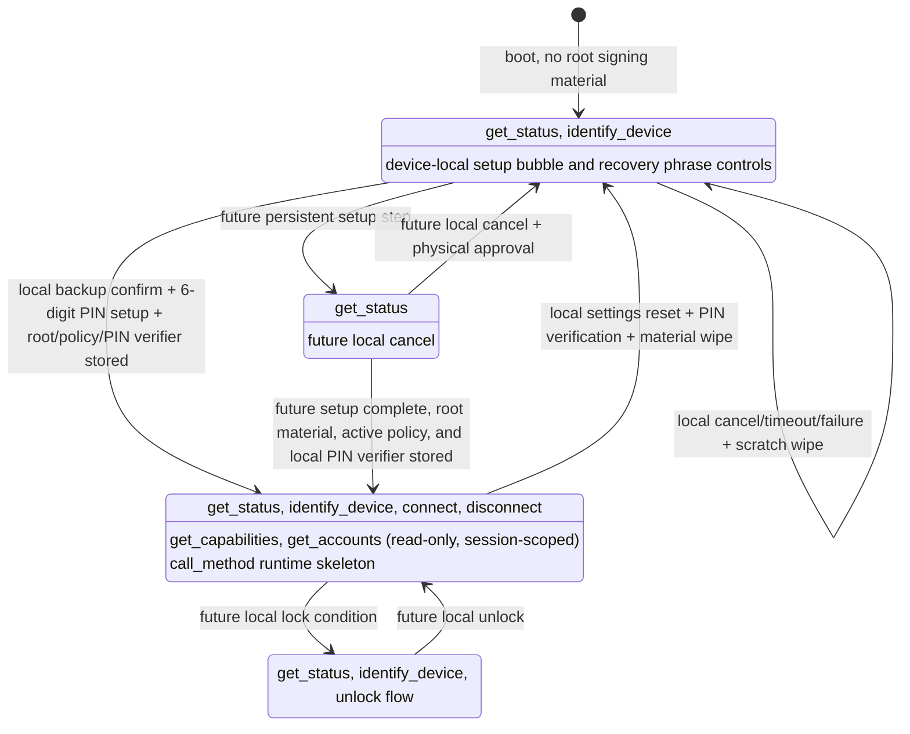
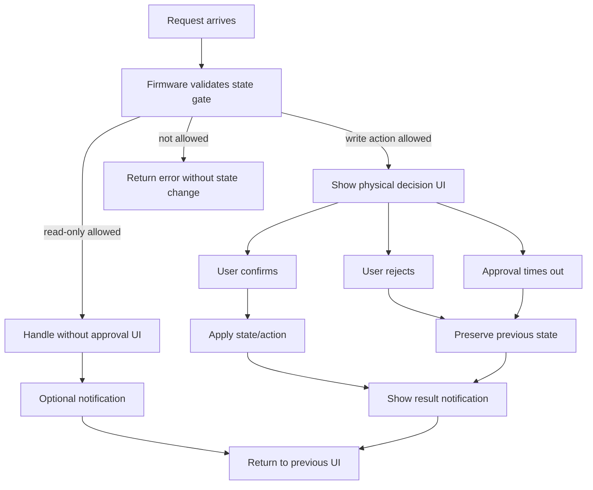

# Agent-Q State Model

This document defines Agent-Q product states, allowed protocol functions, and
module responsibility boundaries.

It is a design contract for current and future implementation. Current
implementation status lives in `docs/IMPLEMENTATION_STATUS.md`. The wire message
contract lives in `specs/PROTOCOL.md`.

## Source Of Truth

State names are defined by:

- `specs/PROTOCOL.md`
- `products/gateway/src/safe-text.ts`

Gateway wire validation is implemented in:

- `products/gateway/src/protocol.ts`

Firmware owns state storage, state transitions, state gates, physical approval,
policy evaluation, and signing decisions.

Gateway may cache and display Firmware-reported state. Gateway must not treat a
state as signing readiness and must not decide whether signing is safe.

## Product State Diagram

This diagram shows product state, not UI state. Firmware owns these transitions.
Gateway, MCP clients, and Admin Page requests may ask for transitions, but they
are not authority.



Current StackChan CoreS3 persistent root material flow starts from
`unprovisioned`. It generates recovery phrase scratch in RAM, displays only
up-to-4-letter BIP-39 word prefixes on the device in a 3-column by 4-row grid,
stores the binary BIP-39 root entropy and active default-reject policy only
after physical backup confirmation and local 6-digit PIN setup, and wipes
scratch on confirmation, cancellation, timeout, failure, or display expiry.
Three-letter BIP-39 words are displayed as the full word. `provisioned` may be
reported only when the persisted state, stored root material, stored active
policy, and stored local PIN verifier all exist. The PIN verifier is a
DEV_PROFILE local UX gate only; it does not encrypt root material.
`locked` remains a design target until an unlock model exists.

For DEV_PROFILE upgrade compatibility, if Firmware boots with the previous
development shape (`prov_state = provisioned` and valid root material, but no
policy record), it initializes the default-reject active policy before reporting
`provisioned`. Any failure to initialize that policy is a consistency error.

If persisted state, stored root material, and stored active policy disagree,
or if the stored local PIN verifier is missing or invalid while `provisioned`,
Firmware reports device `error` and fails closed for normal setup and session
requests. Detecting the consistency error also clears any active RAM session
immediately, so a session created before the error is not retained as a stale
local capability. The current StackChan CoreS3 source does not expose a USB
reset or debug recovery request. Its local reset path is device-local UX only:
provisioned devices can enter local settings, choose Reset, verify the stored
local PIN, and then wipe root material, active policy, PIN verifier,
runtime session, and provisioning state before returning to `unprovisioned`.
Firmware records an internal reset-pending marker before destructive wipe starts
so an interrupted reset can resume at boot. This reset path is not an
error-state recovery path.

## State Layers And Owners

Agent-Q separates product state from target-local runtime state. Product state
is common across hardware targets. Target-local runtime state may differ by
hardware and must be documented in each target's `SPEC.md`.

| Layer | Examples | Owner | May gate protocol APIs? |
|---|---|---|---:|
| Persistent device state | provisioning state, stored root material, policy, local PIN verifier, account availability | Firmware | Yes |
| Volatile sensitive scratch | generated recovery phrase, setup entropy, pending backup confirmation, typed PIN digits | Firmware | Yes |
| Local PIN authorization state | connect/settings/reset PIN entry purpose, verification stage, timeout, RAM-only lockout | Firmware | Yes |
| Pending approval state | active Firmware-owned device-local approval request, such as physical Confirm or connect PIN approval; timeout; requested action | Firmware | Yes |
| Runtime session state | active protocol session id and expiry | Firmware; Gateway mirrors its own client session state | Yes |
| Target-local display state | screen on/off, brightness, screensaver replacement | Firmware target display module | No |
| Target-local posture state | servo position, haptics, LEDs, temporary expression feedback | Firmware target UI/motion module | No |
| UI object lifetime | speech bubble, modal, setup panel, decorator id | Firmware target UI module | No |

UI objects, display power, avatar expressions, servo movement, LEDs, and sounds
may represent or notify about product state. They must not be the source of
truth for provisioning, sessions, accounts, policy, signing, sensitive scratch,
or pending approval.

## Product States

### `unprovisioned`

No root signing material is stored.

Allowed:

- `get_status`
- `identify_device`
- device-local setup speech bubble, Generate/Recover choice, recovery phrase
  Cancel/Confirm controls, and mnemonic recovery word-entry controls

Rejected:

- `connect` until persistent root material, active policy, and local PIN verifier exist and the
  device is `provisioned`
- `get_capabilities`
- `get_accounts`
- `call_method`
- USB provisioning/reset/diagnostic requests
- policy read/write
- signing
- external evidence or price fetch

Current mnemonic setup and mnemonic recovery are volatile substates under
`unprovisioned` until the user physically confirms backup or completes local
word entry, enters and repeats a 6-digit local PIN, and Firmware stores root
material, active policy, and the PIN verifier. The host never receives the
phrase, its up-to-4-letter prefixes, entered recovery words, or the PIN.

### `provisioning`

Local setup is active.

Allowed:

- `get_status`
- `identify_device` only when it does not disrupt setup UI
- future device-local cancel

Rejected:

- `get_capabilities`
- `get_accounts`
- `call_method`
- policy read/write
- signing
- external evidence or price fetch

Scratch signing material may exist only inside Firmware during setup steps.
Canceling setup must wipe scratch material before returning to `unprovisioned`.
Current StackChan CoreS3 source limits recovery phrase and typed PIN scratch to
RAM and tracks setup with volatile substates: `none`,
`setup_choice`, `recovery_phrase_displayed`, `recover_word_entry`,
`pin_first_entry`, `pin_repeat_entry`, and `pin_committing`. Those scratch
substates are separate from persistent
`provisioning.state`, pending approval state, and UI panel state.
The current StackChan CoreS3 persistent material slice resets stale
`provisioning` state to `unprovisioned` when no valid root material or active
policy exists and does not enter this state for the normal
generate-and-confirm flow.

### `provisioned`

Root signing material and an active policy exist in device-local storage. In
the current StackChan CoreS3 DEV_PROFILE implementation this means a binary
BIP-39 entropy blob, the active default-reject policy record, and a local
6-digit PIN verifier record are stored in ordinary NVS and `prov_state` is
`provisioned`; read-only Sui account derivation, read-only active policy
summary, and source-level local reset/material wipe are implemented, while
signing, policy update, and USER_PROFILE secure storage gates are still
separate work.

Allowed:

- `get_status`
- `identify_device`
- `connect`
- `disconnect`
- `get_capabilities` (read-only, session-scoped)
- `get_accounts` (read-only, session-scoped)
- `get_policy` (read-only, session-scoped)
- `call_method` runtime skeleton (session-scoped; unknown methods reject, and Sui
  `sign_transaction` is recognized only for rejected policy-decision smoke)
- device-local settings reset/material wipe after a local Settings Reset action
  and stored PIN verification; successful reset also erases the local
  connect-approval setting so the next setup returns to the missing-key
  secure default
- device-local settings toggle for whether USB `connect` requires local PIN;
  changing the toggle requires stored PIN verification
- policy update only after an authorization/update surface is implemented

This state is not blanket signing approval. Policy still decides whether each
request signs, rejects, or asks. In the current StackChan CoreS3
implementation, `provisioned` enables `connect`, `disconnect`, read-only
`get_capabilities` (`methods: []`), read-only `get_accounts` (Sui Ed25519
account 0), read-only `get_policy` for the active default-reject policy summary,
the `call_method` runtime skeleton (unknown methods rejected with
`unsupported_method`, while Sui `sign_transaction` policy-decision smoke consumes
the active policy and returns only rejected method results); signing remains
unavailable.
Future signing txBytes decoding is allowed only inside a session-scoped
`call_method` signing path after `provisioned`; it must remain unavailable in
`unprovisioned`, `provisioning`, `locked`, and the internal consistency-error
condition. Current common firmware source includes a restricted host-tested SUI
transfer facts parser, a Sui facts-to-policy adapter, a stored-policy provider
boundary, and a host-tested policy evaluator. These are firmware foundations
only: StackChan CoreS3 consumes the stored active default-reject policy decision
for Sui `sign_transaction` policy-decision smoke, capabilities still advertise no
signing methods, and Gateway must not evaluate policy. A corrupt or unreadable
active policy is a persistent-material consistency error, not a normal
`provisioned` state. A missing active policy is migrated only for the documented
DEV_PROFILE legacy shape where `prov_state = provisioned` and root material is
valid; outside that compatibility path it is also a consistency error.
There is no automatic migration for provisioned DEV_PROFILE devices that lack
the local PIN verifier; those devices fail closed until erased and reprovisioned
through a local UX or development reflash workflow.

### `error`

Firmware detected a persistent-material consistency error. This is a fail-closed
runtime report, not a persisted provisioning state. It is used when the stored
provisioning flag and the required material records disagree, or when material
becomes unreadable after a session had existed.

Allowed:

- `get_status`
- `identify_device`
- `disconnect` only as session lifecycle cleanup; if the session was already
  cleared, Firmware returns `invalid_session`

Rejected:

- `connect`
- `get_capabilities`
- `get_accounts`
- `get_policy`
- `call_method`
- policy update
- signing

This state currently has no normal on-device erase-only recovery path. Recovery
requires a separate product decision because it would allow destructive material
wipe without a readable PIN verifier.

### `locked`

Sensitive actions require local unlock.

Allowed:

- `get_status`
- `identify_device`
- unlock flow

Rejected until unlocked:

- `get_accounts`
- `get_policy`
- `call_method`
- policy read
- policy update
- signing

This state is reserved until an unlock model is implemented.

## API / State Matrix

| Function | `unprovisioned` | `provisioning` | `provisioned` | `error` | `locked` | Owner |
|---|---:|---:|---:|---:|---:|---|
| `get_status` | O | O | O | O | O | Firmware |
| `identify_device` | O | O* | O | O | O | Firmware |
| `connect` | X | X | O | X | TBD | Firmware |
| `disconnect` | S | S | S | S | S | Firmware |
| USB provisioning/reset/diagnostic requests | X | X | X | X | X | Firmware |
| `get_capabilities` | X | X | O | X | X | Firmware |
| `get_accounts` | X | X | O | X | X | Firmware |
| `get_policy` | X | X | O | X | X | Firmware |
| `call_method` | X | X | O | X | X | Firmware |
| policy read | X | X | O | X | X | Firmware |
| policy update | X | X | X (future: authorization required) | X | X | Firmware |

`O*`: allowed only when the request does not disrupt local setup UI. `S` means
session cleanup only: Firmware does not require material readiness, but a
missing or mismatched session returns `invalid_session`. Other `O` operations
may still return `busy` while a physical
approval prompt or device-only setup material display is active.

Gateway may hide unavailable operations, but Firmware must still reject them.

The current StackChan CoreS3 target has an explicit `local_pin_auth` runtime
substate for local PIN authorization. It records `purpose`
(`connect` or `settings_toggle`), `stage` (`pin_entry`, `pin_verifying`, or
`committing_setting`), typed PIN scratch, deadline, and RAM-only attempt state.
The UI panel may display that state, but panel existence is not the source of
truth. The target must not expose a USB/Gateway/MCP PIN submit request.

## Boot Flows

First install:

```text
Boot
-> load provisioning state
-> no root signing material
-> unprovisioned
-> welcome with touchable setup speech bubble
-> setup speech bubble touch
-> generate mnemonic on device
-> show up-to-4-letter prefixes once on device
-> user confirms backup or cancels on device
-> if confirmed, enter and repeat a 6-digit local PIN on device
-> if PINs match, store root material, active policy, and PIN verifier locally
-> only after storage succeeds, provisioned
-> wipe volatile scratch
-> ready
```

Reboot after provisioning:

```text
Boot
-> load provisioning state
-> verify root signing material, active policy, and local PIN verifier exist
-> provisioned
-> welcome
-> ready
```

If stored state and signing material disagree, Firmware must fail closed rather
than pretending signing is ready.

## UI State

UI state is not product state. UI only represents product state or a temporary
request.

Common UI states:

- welcome
- idle avatar
- recovery phrase display
- notification
- decision prompt
- result notification
- error notification

Rules:

- Normal requests should not force a dedicated Agent-Q mode.
- Temporary UI should close and return control to the previous device mode when
  possible.
- Read-only requests must not open physical approval UI.

## Target-Local Display Power State

Display power state is not product state and must not gate protocol APIs,
provisioning, sessions, accounts, policy, or signing. It only controls whether
the local screen, backlight, or equivalent display surface is active.

Display power states:

- `screen_active`: backlight is on.
- `screen_off`: backlight is off; Firmware and protocol state continue running.

`screen_off` must not clear provisioning scratch, pending approvals, sessions,
or root material. Those states are owned by their explicit Firmware modules.
Agent-Q request UI should wake the screen before showing setup material,
notifications, or physical approval prompts when the target has a screen.

Hardware-specific timing, buttons, and power-off behavior are target-local. The
current StackChan CoreS3 behavior is documented in
`products/firmware/src/stackchan-cores3/SPEC.md`.

## Target-Local Posture State

Physical posture is not product state and must not gate protocol APIs,
provisioning, sessions, accounts, policy, or signing. It only controls the
target's optional motion, LED, haptic, sound, or expression feedback.

Posture changes must not clear provisioning scratch, pending approvals,
sessions, root material, or display power state. Hardware targets may move to a
target-local rest posture before screen-off or power-off and return to an awake
posture when the display wakes, but those postures are feedback only and must
not gate protocol behavior.
Hardware-specific posture ownership, boot feedback, sleep feedback, and wake
feedback are target-local. The current StackChan CoreS3 behavior is documented in
`products/firmware/src/stackchan-cores3/SPEC.md`.

## Request Patterns



Silent internal handling:

```text
request
-> validate state gate
-> handle internally
-> optional notification
-> return to previous UI
```

User decision:

```text
request
-> validate state gate
-> show decision UI
-> confirm / reject / timeout
-> apply state or action only after confirm
-> show result
-> return to previous UI
```

While a decision is pending:

- UI-affecting write requests return `busy`.
- `get_status` remains allowed.
- state is not changed on reject or timeout.
