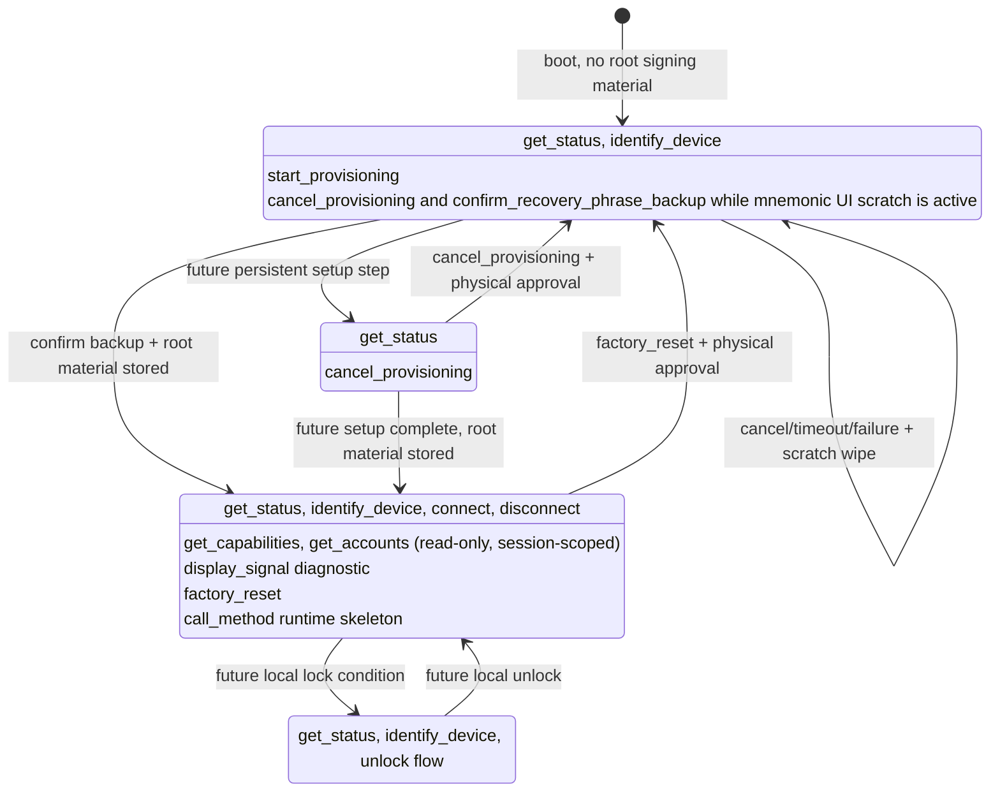
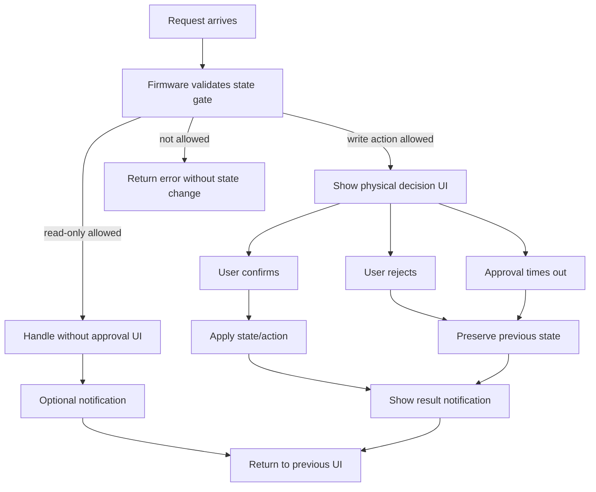

# Agent-Q State Model

This document defines Agent-Q product states, allowed protocol functions, and
module responsibility boundaries.

It is a design contract for current and future implementation. Current
implementation status lives in `docs/IMPLEMENTATION_STATUS.md`. The wire message
contract lives in `specs/PROTOCOL.md`.

## Source Of Truth

State names are defined by:

- `specs/PROTOCOL.md`
- `products/gateway/src/safe-text.ts`

Gateway wire validation is implemented in:

- `products/gateway/src/protocol.ts`

Firmware owns state storage, state transitions, state gates, physical approval,
policy evaluation, and signing decisions.

Gateway may cache and display Firmware-reported state. Gateway must not treat a
state as signing readiness and must not decide whether signing is safe.

## Product State Diagram

This diagram shows product state, not UI state. Firmware owns these transitions.
Gateway, MCP clients, and Admin Page requests may ask for transitions, but they
are not authority.



Current StackChan CoreS3 persistent root material flow starts from
`unprovisioned`. It generates recovery phrase scratch in RAM, displays only
up-to-4-letter BIP-39 word prefixes on the device in a 3-column by 4-row grid,
stores the binary BIP-39 root entropy only after physical backup confirmation,
and wipes scratch on confirmation, cancellation, timeout, failure, or display
expiry. Three-letter BIP-39 words are displayed as the full word.
`provisioned` may be reported only when the persisted state and stored root
material both exist. `locked` remains a design target until an unlock model
exists.

If persisted state and stored root material disagree, Firmware reports device
`error` and fails closed for normal setup and session requests. `factory_reset`
is the recovery path for that consistency-error condition: after physical
approval, Firmware erases root material, clears volatile scratch and RAM
sessions, persists `unprovisioned`, and clears the error only after storage
cleanup succeeds.
Detecting the consistency error also clears any active RAM session immediately,
so a session created before the error is not retained as a stale local
capability.

## State Layers And Owners

Agent-Q separates product state from target-local runtime state. Product state
is common across hardware targets. Target-local runtime state may differ by
hardware and must be documented in each target's `SPEC.md`.

| Layer | Examples | Owner | May gate protocol APIs? |
|---|---|---|---:|
| Persistent device state | provisioning state, stored root material, policy, account availability | Firmware | Yes |
| Volatile sensitive scratch | generated recovery phrase, setup entropy, pending backup confirmation | Firmware | Yes |
| Pending approval state | active physical approval request, timeout, requested action | Firmware | Yes |
| Runtime session state | active protocol session id and expiry | Firmware; Gateway mirrors its own client session state | Yes |
| Target-local display state | screen on/off, brightness, screensaver replacement | Firmware target display module | No |
| Target-local posture state | servo position, haptics, LEDs, temporary expression feedback | Firmware target UI/motion module | No |
| UI object lifetime | speech bubble, modal, setup panel, decorator id | Firmware target UI module | No |

UI objects, display power, avatar expressions, servo movement, LEDs, and sounds
may represent or notify about product state. They must not be the source of
truth for provisioning, sessions, accounts, policy, signing, sensitive scratch,
or pending approval.

## Product States

### `unprovisioned`

No root signing material is stored.

Allowed:

- `get_status`
- `identify_device`
- `start_provisioning`
- `cancel_provisioning` only while volatile mnemonic setup scratch or its
  confirmation prompt is active
- `confirm_recovery_phrase_backup` only while volatile mnemonic setup scratch is
  displayed
- device-local setup speech bubble and recovery phrase Cancel/Confirm controls

Rejected:

- `connect` until persistent root material exists and the device is
  `provisioned`
- `get_capabilities`
- `get_accounts`
- `call_method`
- `display_signal`
- policy read/write
- signing
- external evidence or price fetch

Current mnemonic setup is a volatile substate under `unprovisioned` until the
user physically confirms backup and Firmware stores root material. The host
never receives the phrase or its up-to-4-letter prefixes.

### `provisioning`

Local setup is active.

Allowed:

- `get_status`
- `identify_device` only when it does not disrupt setup UI
- `cancel_provisioning`

Rejected:

- `get_capabilities`
- `get_accounts`
- `call_method`
- policy read/write
- signing
- external evidence or price fetch

Scratch signing material may exist only inside Firmware during setup steps.
Canceling setup must wipe scratch material before returning to `unprovisioned`.
Current StackChan CoreS3 source limits recovery phrase scratch material to RAM
and tracks it with a volatile substate: `none`, `displayed`, or
`backup_confirmation_pending`. That scratch substate is separate from the
persistent `provisioning.state`, pending approval state, and UI panel state.
The current StackChan CoreS3 persistent root material slice resets stale
`provisioning` state to `unprovisioned` when no valid root material exists and
does not enter this state for the normal generate-and-confirm flow.

### `provisioned`

Root signing material exists in device-local storage. In the current StackChan
CoreS3 DEV_PROFILE implementation this means a binary BIP-39 entropy blob is
stored in NVS and `prov_state` is `provisioned`; read-only Sui account
derivation is implemented, while signing, policy, and USER_PROFILE secure
storage gates are still separate work.

Allowed:

- `get_status`
- `identify_device`
- `connect`
- `disconnect`
- `display_signal` diagnostic
- `get_capabilities` (read-only, session-scoped)
- `get_accounts` (read-only, session-scoped)
- `call_method` runtime skeleton (session-scoped; unknown methods reject, and Sui
  `sign_transaction` is recognized only for rejected policy-decision smoke)
- policy read/update only after those protocol surfaces are implemented

This state is not blanket signing approval. Policy still decides whether each
request signs, rejects, or asks. In the current StackChan CoreS3
implementation, `provisioned` enables `connect`, `disconnect`, read-only
`get_capabilities` (`methods: []`), read-only `get_accounts` (Sui Ed25519
account 0), the `call_method` runtime skeleton (unknown methods rejected with
`unsupported_method`, while Sui `sign_transaction` policy-decision smoke returns
only rejected method results), and the `display_signal` diagnostic; signing
remains unavailable.
Future signing txBytes decoding is allowed only inside a session-scoped
`call_method` signing path after `provisioned`; it must remain unavailable in
`unprovisioned`, `provisioning`, `locked`, and the internal consistency-error
condition. Current common firmware source includes a restricted host-tested SUI
transfer facts parser, a Sui facts-to-policy adapter, a default-reject policy
provider boundary, and a host-tested policy evaluator. These are common firmware
foundations only: StackChan CoreS3 consumes the default-reject policy decision
for Sui `sign_transaction` policy-decision smoke, capabilities still advertise no
signing methods, and Gateway must not evaluate policy.

### `locked`

Sensitive actions require local unlock.

Allowed:

- `get_status`
- `identify_device`
- unlock flow

Rejected until unlocked:

- `get_accounts`
- `call_method`
- policy update
- signing

This state is reserved until an unlock model is implemented.

## API / State Matrix

| Function | `unprovisioned` | `provisioning` | `provisioned` | `locked` | Owner |
|---|---:|---:|---:|---:|---|
| `get_status` | O | O | O | O | Firmware |
| `identify_device` | O | O* | O | O | Firmware |
| `connect` | X | X | O | TBD | Firmware |
| `disconnect` | X | X | O | O | Firmware |
| `start_provisioning` | O | X | X | X | Firmware |
| `cancel_provisioning` | O* | O | X | X | Firmware |
| `confirm_recovery_phrase_backup` | O* | X | X | X | Firmware |
| `factory_reset` | O | O | O | TBD | Firmware |
| `display_signal` | X | X | O | X | Firmware |
| `get_capabilities` | X | X | O | X | Firmware |
| `get_accounts` | X | X | O | X | Firmware |
| `call_method` | X | X | O | X | Firmware |
| policy read | X | X | O | X | Firmware |
| policy update | X | X | O, with authorization | X | Firmware |

`O*`: allowed only while volatile mnemonic setup scratch or its confirmation
prompt is active. Other `O` operations may still return `busy` while a physical
approval prompt or device-only setup material display is active.
`factory_reset` is also allowed from Firmware's internal consistency-error
state even though that error state is reported as `device.state = error`, not as
a separate `provisioning.state` value. It is a DEV_PROFILE development/recovery
operation and must not be exposed as a normal agent-facing MCP tool.

Gateway may hide unavailable operations, but Firmware must still reject them.

## Boot Flows

First install:

```text
Boot
-> load provisioning state
-> no root signing material
-> unprovisioned
-> welcome with touchable setup speech bubble
-> setup speech bubble touch or start_provisioning request
-> generate mnemonic on device
-> show up-to-4-letter prefixes once on device
-> user confirms backup or cancels on device, or through an approved protocol request
-> if confirmed, store root material locally
-> only after storage succeeds, provisioned
-> wipe volatile scratch
-> ready
```

Reboot after provisioning:

```text
Boot
-> load provisioning state
-> verify root signing material exists
-> provisioned
-> welcome
-> ready
```

If stored state and signing material disagree, Firmware must fail closed rather
than pretending signing is ready.

## UI State

UI state is not product state. UI only represents product state or a temporary
request.

Common UI states:

- welcome
- idle avatar
- recovery phrase display
- notification
- decision prompt
- result notification
- error notification

Rules:

- Normal requests should not force a dedicated Agent-Q mode.
- Temporary UI should close and return control to the previous device mode when
  possible.
- Read-only requests must not open physical approval UI.

## Target-Local Display Power State

Display power state is not product state and must not gate protocol APIs,
provisioning, sessions, accounts, policy, or signing. It only controls whether
the local screen, backlight, or equivalent display surface is active.

Display power states:

- `screen_active`: backlight is on.
- `screen_off`: backlight is off; Firmware and protocol state continue running.

`screen_off` must not clear provisioning scratch, pending approvals, sessions,
or root material. Those states are owned by their explicit Firmware modules.
Agent-Q request UI should wake the screen before showing setup material,
notifications, or physical approval prompts when the target has a screen.

Hardware-specific timing, buttons, and power-off behavior are target-local. The
current StackChan CoreS3 behavior is documented in
`products/firmware/src/stackchan-cores3/SPEC.md`.

## Target-Local Posture State

Physical posture is not product state and must not gate protocol APIs,
provisioning, sessions, accounts, policy, or signing. It only controls the
target's optional motion, LED, haptic, sound, or expression feedback.

Posture changes must not clear provisioning scratch, pending approvals,
sessions, root material, or display power state. Hardware targets may move to a
target-local rest posture before screen-off or power-off and return to an awake
posture when the display wakes, but those postures are feedback only and must
not gate protocol behavior.
Hardware-specific posture ownership, boot feedback, sleep feedback, and wake
feedback are target-local. The current StackChan CoreS3 behavior is documented in
`products/firmware/src/stackchan-cores3/SPEC.md`.

## Request Patterns



Silent internal handling:

```text
request
-> validate state gate
-> handle internally
-> optional notification
-> return to previous UI
```

User decision:

```text
request
-> validate state gate
-> show decision UI
-> confirm / reject / timeout
-> apply state or action only after confirm
-> show result
-> return to previous UI
```

While a decision is pending:

- UI-affecting write requests return `busy`.
- `get_status` remains allowed.
- state is not changed on reject or timeout.
