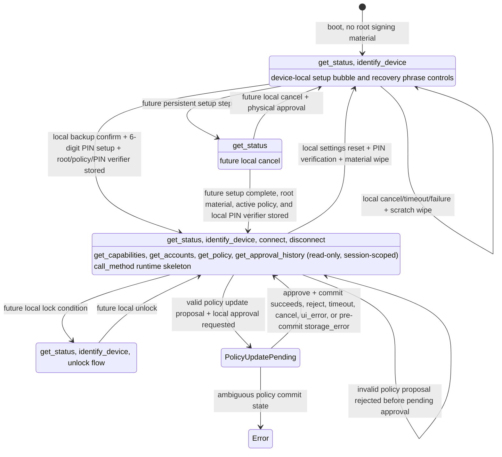
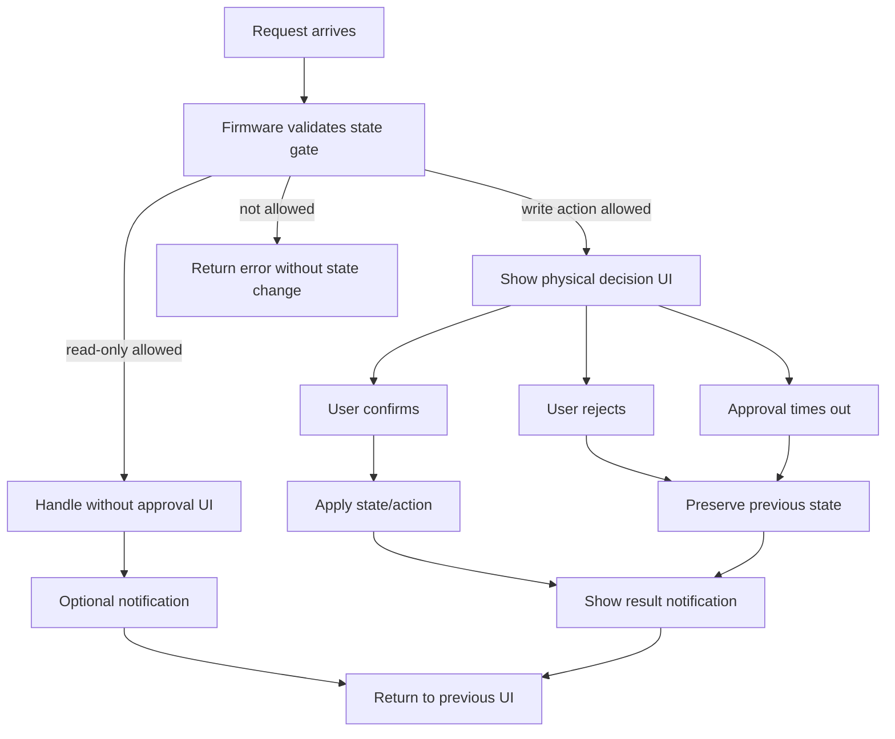

# Agent-Q State Model

This document defines Agent-Q product states, allowed protocol functions, and
module responsibility boundaries.

It is a design contract for current and future implementation. Current
implementation status lives in `docs/IMPLEMENTATION_STATUS.md`. The wire message
contract lives in `specs/PROTOCOL.md`.

## Source Of Truth

State names are defined by:

- `specs/PROTOCOL.md`
- `packages/client/src/safe-text.ts`

Gateway wire validation is implemented in:

- `packages/client/src/protocol.ts`

Firmware owns state storage, state transitions, state gates, physical approval,
policy evaluation, and signing decisions.

Gateway may cache and display Firmware-reported state. Gateway must not treat a
state as signing readiness and must not decide whether signing is safe.

## Product State Diagram

This diagram shows product state, not UI state. Firmware owns these transitions.
Gateway, MCP clients, and Admin Page requests may submit requests, but they are
not authority. Firmware state transitions occur only as consequences of
Firmware-owned conditions and validated local input.



Current StackChan CoreS3 persistent root material flow starts from
`unprovisioned`. It generates recovery phrase scratch in RAM, displays only
up-to-4-letter BIP-39 word prefixes on the device in a 3-column by 4-row grid,
stores the binary BIP-39 root entropy and an active policy record only
after physical backup confirmation and local 6-digit PIN setup, and wipes
scratch on confirmation, cancellation, timeout, failure, or display expiry.
Three-letter BIP-39 words are displayed as the full word. `provisioned` may be
reported only when the persisted state, stored root material, stored active
policy, and stored local PIN verifier all exist. The PIN verifier is a
DEV_PROFILE local UX gate only; it does not encrypt root material.
`locked` remains a design target until an unlock model exists.

Firmware recognizes only the current tracked persistent material layout as
product state. The current StackChan CoreS3 persisted provisioning-state schema
accepts only `unprovisioned` and `provisioned`; transient or unsupported
persisted values such as `provisioning` are not normalized into product state.
If Firmware boots with an unsupported `prov_state`, or with
`prov_state = provisioned` but no valid active policy record, the device enters
persistent material consistency error until either a device-local destructive
wipe or a development flash-erase workflow clears the unsupported material set.
After that cleanup, local setup or recovery can reprovision the device.

If persisted state, stored root material, and stored active policy disagree,
or if the stored local PIN verifier is missing or invalid while `provisioned`,
Firmware reports device `error` and fails closed for normal setup and session
requests. Detecting the consistency error also clears any active RAM session
immediately, so a session created before the error is not retained as a stale
local capability. The current StackChan CoreS3 source does not expose a USB
reset or debug recovery request. Its local settings paths are device-local UX
only: provisioned devices can enter local settings, verify the stored local PIN
to change the local PIN verifier, or choose Reset, verify the stored local PIN,
and then wipe root material, active policy, PIN verifier, approval history,
policy-update terminal marker, local connect setting, runtime session, and
provisioning state before returning to `unprovisioned`.
Firmware records an internal reset-pending marker before destructive wipe starts
so an interrupted reset can resume at boot. The same destructive wipe machinery
is also used by a device-local erase-only recovery from the `error` state.
That recovery has no PIN requirement because the PIN verifier may be unreadable,
but it still requires on-device confirmation and is not exposed as a USB,
Gateway, MCP, or host-triggered API.

## State Layers And Owners

Agent-Q separates product state from target-local runtime state. Product state
is common across hardware targets. Target-local runtime state may differ by
hardware and must be documented in each target's `SPEC.md`.

| Layer | Examples | Owner | May gate protocol APIs? |
|---|---|---|---:|
| Persistent device state | provisioning state, stored root material, policy, local PIN verifier, approval history, policy-update terminal marker, account availability | Firmware | Yes |
| Volatile sensitive scratch | generated recovery phrase, setup entropy, pending backup confirmation, typed PIN digits | Firmware | Yes |
| Local PIN authorization state | connect/settings/policy-update/reset PIN entry purpose, verification stage, timeout, RAM-only lockout | Firmware | Yes |
| Pending approval state | active Firmware-owned device-local approval request, such as physical Confirm or connect PIN approval; timeout; requested action | Firmware | Yes |
| Pending policy update state | validated policy proposal summary, policy hash, approval deadline, commit stage | Firmware | Yes |
| Planned pending method approval state | signing request id, session id, chain/method, transaction summary or digest, policy decision, approval deadline, and signing cleanup stage | Firmware | Yes |
| Runtime session state | active protocol session id and link-bound cleanup state | Firmware; Gateway mirrors its own client session state in RAM and clears that mirror when Firmware rejects it or live USB scan no longer observes the device | Yes |
| Target-local display state | screen on/off, brightness, screensaver replacement | Firmware target display module | No |
| Target-local posture state | servo position, haptics, LEDs, temporary expression feedback | Firmware target UI/motion module | No |
| UI object lifetime | speech bubble, modal, setup panel, decorator id | Firmware target UI module | No |

UI objects, display power, avatar expressions, servo movement, LEDs, and sounds
may represent or notify about product state. They must not be the source of
truth for provisioning, sessions, accounts, policy, signing, sensitive scratch,
or pending approval.

## Product States

### `unprovisioned`

No root signing material is stored.

Allowed:

- `get_status`
- `identify_device`
- device-local setup speech bubble, Generate/Recover choice, recovery phrase
  Cancel/Confirm controls, and mnemonic recovery word-entry controls

Rejected:

- `connect` until persistent root material, active policy, and local PIN verifier exist and the
  device is `provisioned`
- `get_capabilities`
- `get_accounts`
- `get_policy`
- `get_approval_history`
- `call_method`
- USB provisioning/reset/diagnostic requests
- policy read/write
- signing
- external evidence or price fetch

Current mnemonic setup and mnemonic recovery are volatile substates under
`unprovisioned` until the user physically confirms backup or completes local
word entry, enters and repeats a 6-digit local PIN, and Firmware stores root
material, active policy, and the PIN verifier. The host never receives the
phrase, its up-to-4-letter prefixes, entered recovery words, or the PIN.

### `provisioning`

Local setup is active.

Allowed:

- `get_status`
- `identify_device` only when it does not disrupt setup UI
- future device-local cancel

Rejected:

- `get_capabilities`
- `get_accounts`
- `get_policy`
- `get_approval_history`
- `call_method`
- policy read/write
- signing
- external evidence or price fetch

Scratch signing material may exist only inside Firmware during setup steps.
Canceling setup must wipe scratch material before returning to `unprovisioned`.
Current StackChan CoreS3 source limits recovery phrase and typed PIN scratch to
RAM and tracks setup with volatile substates: `none`,
`setup_choice`, `recovery_phrase_displayed`, `recover_word_entry`,
`pin_first_entry`, `pin_repeat_entry`, and `pin_committing`. Those scratch
substates are separate from persistent
`provisioning.state`, pending approval state, and UI panel state.
The current StackChan CoreS3 persistent material implementation does not persist
`provisioning` for the normal generate-and-confirm flow and does not accept it
as a current tracked storage value. If an unsupported persisted
provisioning-state value is present, Firmware fails closed with persistent
material consistency error rather than silently resetting it to
`unprovisioned`.

### `provisioned`

Root signing material and a committed active policy exist in device-local
storage. In the current StackChan CoreS3 DEV_PROFILE implementation this means a
binary BIP-39 entropy blob, a canonical active policy record, and a local
6-digit PIN verifier record are stored in ordinary NVS and `prov_state` is
`provisioned`; the normal product flow installs the default-reject policy, while
read-only Sui account derivation, read-only active policy summary,
source-level local reset/material wipe, and the Firmware-owned
`propose_policy_update` proposal flow for custom reject policies are
implemented. Signing and USER_PROFILE secure storage gates are still separate
work.

Allowed:

- `get_status`
- `identify_device`
- `connect`
- `disconnect`
- `get_capabilities` (read-only, session-scoped)
- `get_accounts` (read-only, session-scoped)
- `get_policy` (read-only, session-scoped)
- `get_approval_history` (read-only, session-scoped)
- `call_method` runtime skeleton (session-scoped; unknown methods reject, and Sui
  `sign_transaction` is recognized only for rejected policy-decision smoke)
- device-local settings reset/material wipe after a local Settings Reset action
  and stored PIN verification; successful reset also erases the local
  connect-approval setting, approval history, and policy-update terminal marker
  so the next setup returns to the missing-key secure default without prior
  decision records or an incomplete policy-update terminal state
- device-local settings toggle for whether USB `connect` requires local PIN;
  changing the toggle requires stored PIN verification
- policy update through the Firmware-owned `propose_policy_update` proposal
  flow, which requires an active session, Firmware validation, and device-local
  approval; the pending approval remains tied to the same session and cannot
  commit after that session ends, disconnects, or no longer matches

This state is not blanket signing approval. Policy still decides whether each
request signs, rejects, or asks. In the current StackChan CoreS3
implementation, `provisioned` enables `connect`, `disconnect`, read-only
`get_capabilities` (`methods: []`), read-only `get_accounts` (Sui Ed25519
account 0), read-only `get_policy` for the committed active policy summary,
read-only `get_approval_history` for Firmware-owned persistent decision
metadata, the `call_method` runtime skeleton (unknown methods rejected with
`unsupported_method`, while Sui `sign_transaction` policy-decision smoke consumes
the active policy and returns only rejected method results); signing remains
unavailable.
Future signing txBytes decoding is allowed only inside a session-scoped
`call_method` signing path after `provisioned`; it must remain unavailable in
`unprovisioned`, `provisioning`, `locked`, and the internal consistency-error
condition. Current common firmware source includes a restricted host-tested SUI
transfer facts parser, a Sui method adapter, a stored-policy provider
boundary, and a host-tested policy evaluator. These are Firmware-internal source
paths only: StackChan CoreS3 consumes the committed active policy for Sui
`sign_transaction` policy-decision smoke, capabilities still advertise no signing
methods, and Gateway must not evaluate policy. A corrupt, unreadable, missing,
or unsupported current active policy is a persistent-material consistency
error, not a normal `provisioned` state. Provisioned DEV_PROFILE devices that
lack the current local PIN verifier or active canonical policy fail closed until
erased and reprovisioned through a local UX or development reflash workflow.

#### Pending Policy Update

Policy update is a Firmware-owned pending substate under `provisioned`, not an
external state setter.

Transition:

```text
provisioned
-> valid session-scoped policy proposal
-> Firmware validates bounded policy document
-> pending policy update approval on device
-> local approval + canonical policy commit
-> required policy-update history record
-> provisioned with new active policy
```

Failure behavior:

- invalid policy returns `invalid_policy` before pending approval starts, with
  the previous active policy unchanged;
- user rejection, timeout, cancellation, or approval UI failure returns to
  `provisioned` with the previous active policy unchanged;
- required-history failure before the active-slot flip returns a top-level
  `history_error`, clears the pending proposal, and leaves the previous active
  policy unchanged;
- storage failure before the active-slot flip returns to `provisioned` with the
  previous active policy unchanged;
- required-history failure after the active-slot flip, or ambiguous storage
  state after interruption including a leftover policy-update terminal marker,
  reports `error` instead of a normal `provisioned` state;
- a second policy update proposal while pending is rejected with `busy`.

Allowed while pending:

- `get_status`;
- read-only session APIs only if they do not dismiss, overwrite, or mutate the
  pending proposal;
- `get_policy`, if allowed, reports only the committed active policy and not the
  pending proposal;
- `disconnect` as session cleanup except during the commit critical section,
  where Firmware may return `busy`.

Rejected while pending:

- nested policy updates;
- `call_method`, because request evaluation must not race an uncommitted active
  policy replacement;
- host-triggered reset, debug, import, or state-changing shortcuts.

The pending state may be displayed by UI, but UI object lifetime is not the
source of truth. Firmware owns the proposal summary, approval deadline, commit
stage, cleanup, and rollback behavior.

Firmware must reject policy actions that the current runtime cannot enforce.
Unsupported `ask` or `sign` rules are not stored as dormant future behavior
unless a separate disabled-draft model is specified and approved.

#### Planned Signing Method Approval

The current StackChan CoreS3 source does not implement a signing approval
pending state. Sui `sign_transaction` remains a policy-decision smoke path that
returns only rejected method results and is not advertised in
`get_capabilities`.

Before a signing method can be advertised, Firmware must add an explicit
method-approval pending state under `provisioned`. That state is owned by
Firmware and is not a protocol state setter. Gateway, MCP, Admin Page, and
provider calls may submit a bounded `call_method` request, but they cannot
approve, reject, sign, or force a state transition.

Required state ownership:

- persistent state: root material, active policy, approval history, and session
  consistency remain Firmware-owned;
- volatile sensitive scratch: decoded transaction facts, signing input, and any
  signature buffer remain Firmware-owned and must be wiped on every non-approved
  terminal path;
- pending approval state: original request id, active session id, chain/method,
  payload digest or transaction summary, policy hash, matched rule reference,
  policy decision, deadline, and cleanup stage remain Firmware-owned;
- UI state: a display prompt may mirror the pending approval state, but panel or
  modal lifetime is not the source of truth;
- response state: the USB response writer emits only the terminal protocol
  response selected by the Firmware-owned method approval state.

Allowed while a signing approval is pending:

- `get_status`;
- matching `disconnect` as cancellation before any signing critical section
  starts; if the signing critical section has started, Firmware may return
  `busy` instead.

Rejected while a signing approval is pending:

- `identify_device`, because it would replace or obscure the required local
  approval prompt;
- `connect`;
- `get_capabilities`;
- `get_accounts`;
- `get_policy`;
- `get_approval_history`;
- nested `call_method`;
- `propose_policy_update`;
- host-triggered reset, debug, import, or state-changing shortcuts.

Terminal behavior:

- policy rejection persists a method-decision history record and returns a
  rejected `method_result`;
- policy-approved automatic signing, if implemented, may return an approved
  `method_result` only after the required method-decision history record is
  durable;
- user approval may return an approved `method_result` only after the required
  physical-confirm history record is durable;
- user rejection, timeout, session loss, disconnect, UI failure, method failure,
  or history failure must not return a signature;
- required-history failure returns the protocol history failure instead of a
  `method_result` and wipes signing scratch;
- session loss or disconnect before signing completes cancels the pending
  approval and terminates the original request without signing;
- if the required history record is durable but response delivery fails, the
  record remains decision metadata, Firmware wipes signature scratch, and the
  request is not replayed.

Opening `get_capabilities.chains[].methods` for a signing method requires the
Firmware runtime, method approval state owner, policy `ask`/`sign` handling,
approved method-result schema, required approval-history records, Gateway parser
and output schemas, MCP output, provider API, and target verification to be
implemented for the same method boundary. Parser acceptance alone is not
signing readiness.

### `error`

Firmware detected a persistent-material consistency error. This is a fail-closed
runtime report, not a persisted provisioning state. It is used when the stored
provisioning flag and the required material records disagree, or when material
becomes unreadable after a session had existed.

Allowed:

- `get_status`
- `identify_device`
- `disconnect` only as session lifecycle cleanup; if the session was already
  cleared, Firmware returns `invalid_session`
- device-local erase-only recovery after destructive on-device confirmation;
  this wipes root material, active policy, PIN verifier, local connect setting,
  approval history, policy-update terminal marker, runtime session, and
  provisioning state before returning to `unprovisioned`

Rejected:

- `connect`
- `get_capabilities`
- `get_accounts`
- `get_policy`
- `get_approval_history`
- `call_method`
- policy update
- signing

This recovery is intentionally destructive and cannot read, export, repair, or
unlock root material. It exists only to return a fail-closed device to the
normal local setup path when the stored material set is inconsistent. USB,
Gateway, and MCP clients still cannot trigger reset or recovery.

### `locked`

Sensitive actions require local unlock.

Allowed:

- `get_status`
- `identify_device`
- unlock flow

Rejected until unlocked:

- `get_accounts`
- `get_policy`
- `call_method`
- policy read
- policy update
- signing

This state is reserved until an unlock model is implemented.

## API / State Matrix

| Function | `unprovisioned` | `provisioning` | `provisioned` | `error` | `locked` | Owner |
|---|---:|---:|---:|---:|---:|---|
| `get_status` | O | O | O | O | O | Firmware |
| `identify_device` | O | O* | O | O | O | Firmware |
| `connect` | X | X | O | X | TBD | Firmware |
| `disconnect` | S | S | S | S | S | Firmware |
| USB provisioning/reset/diagnostic requests | X | X | X | X | X | Firmware |
| `get_capabilities` | X | X | O | X | X | Firmware |
| `get_accounts` | X | X | O | X | X | Firmware |
| `get_policy` | X | X | O | X | X | Firmware |
| `get_approval_history` | X | X | O | X | X | Firmware |
| `call_method` | X | X | O | X | X | Firmware |
| policy read | X | X | O | X | X | Firmware |
| policy update | X | X | O (validated proposal + device-local approval) | X | X | Firmware |

`O*`: allowed only when the request does not disrupt local setup UI. `S` means
session cleanup only: Firmware does not require material readiness, but a
missing or mismatched session returns `invalid_session`. `S` operations may
still return `busy` while local setup/PIN/reset or sensitive settings subflow
state is active, because external session teardown must not interleave with
device-local sensitive UI. Idle Settings menu is not itself a sensitive flow and
does not end the active RAM session. Other `O` operations may still return
`busy` while a physical approval prompt or device-only setup material display is
active.

Gateway may hide unavailable operations, but Firmware must still reject them.

The current StackChan CoreS3 target has an explicit `local_pin_auth` runtime
substate for local PIN authorization. It records `purpose` (`connect`,
`settings_connect_pin`, `settings_change_pin`, or `policy_update`), `stage`
(`pin_entry`, `pin_verifying`, `new_pin_entry`, `repeat_pin_entry`,
`committing_setting`, or `committing_pin_change`), typed PIN scratch, new-PIN
scratch where applicable, deadline, and the RAM-only stored-PIN attempt budget
shared with reset PIN verification. For policy updates, `local_pin_auth` owns
only PIN verification; the pending proposal summary, policy hash, commit stage,
and terminal result remain owned by the policy-update flow. The UI panel may
display that state, but panel existence is not the source of truth. The target
must not expose a USB/Gateway/MCP PIN submit request.

## Boot Flows

First install:

```text
Boot
-> load provisioning state
-> no root signing material
-> unprovisioned
-> welcome with touchable setup speech bubble
-> setup speech bubble touch
-> generate mnemonic on device
-> show up-to-4-letter prefixes once on device
-> user confirms backup or cancels on device
-> if confirmed, enter and repeat a 6-digit local PIN on device
-> if PINs match, store root material, active policy, and PIN verifier locally
-> only after storage succeeds, provisioned
-> wipe volatile scratch
-> ready
```

Reboot after provisioning:

```text
Boot
-> load provisioning state
-> verify root signing material, active policy, and local PIN verifier exist
-> provisioned
-> welcome
-> ready
```

If stored state and signing material disagree, Firmware must fail closed rather
than pretending signing is ready.

## UI State

UI state is not product state. UI only represents product state or a temporary
request.

Common UI states:

- welcome
- idle avatar
- recovery phrase display
- notification
- decision prompt
- result notification
- error notification

Rules:

- Normal requests should not force a dedicated Agent-Q mode.
- Temporary UI should close and return control to the previous device mode when
  possible.
- Read-only requests must not open physical approval UI.

## Target-Local Display Power State

Display power state is not product state and must not gate protocol APIs,
provisioning, sessions, accounts, policy, or signing. It only controls whether
the local screen, backlight, or equivalent display surface is active.

Display power states:

- `screen_active`: backlight is on.
- `screen_off`: backlight is off; Firmware and protocol state continue running.

`screen_off` must not clear provisioning scratch, pending approvals, sessions,
or root material. Those states are owned by their explicit Firmware modules.
Agent-Q request UI should wake the screen before showing setup material,
notifications, or physical approval prompts when the target has a screen.

Hardware-specific timing, buttons, and power-off behavior are target-local. The
current StackChan CoreS3 behavior is documented in
`firmware/src/stackchan-cores3/SPEC.md`.

## Target-Local Posture State

Physical posture is not product state and must not gate protocol APIs,
provisioning, sessions, accounts, policy, or signing. It only controls the
target's optional motion, LED, haptic, sound, or expression feedback.

Posture changes must not clear provisioning scratch, pending approvals,
sessions, root material, or display power state. Hardware targets may move to a
target-local rest posture before screen-off or power-off and return to an awake
posture when the display wakes, but those postures are feedback only and must
not gate protocol behavior.
Hardware-specific posture ownership, boot feedback, sleep feedback, and wake
feedback are target-local. The current StackChan CoreS3 behavior is documented in
`firmware/src/stackchan-cores3/SPEC.md`.

## Request Patterns



Silent internal handling:

```text
request
-> validate state gate
-> handle internally
-> optional notification
-> return to previous UI
```

User decision:

```text
request
-> validate state gate
-> show decision UI
-> confirm / reject / timeout
-> apply state or action only after confirm
-> show result
-> return to previous UI
```

While a decision is pending:

- UI-affecting write requests return `busy`.
- `get_status` remains allowed.
- state is not changed on reject or timeout.
