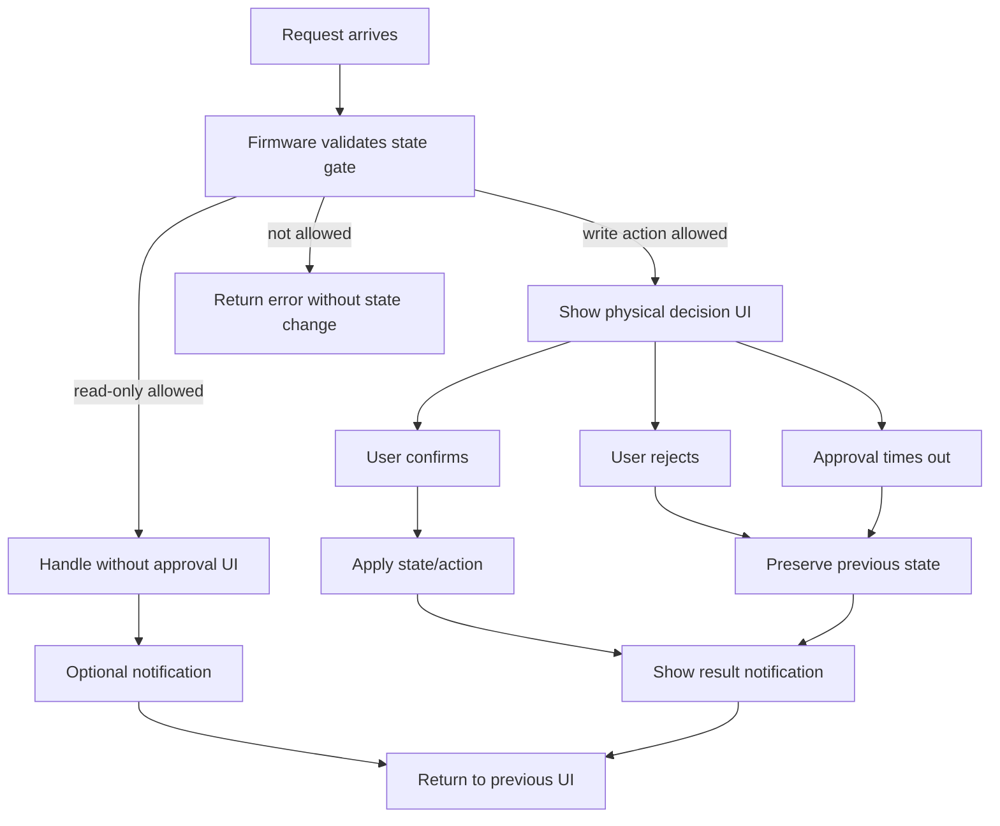

# Agent-Q State Model

This document defines Agent-Q product states, allowed protocol functions, and
module responsibility boundaries.

It is a design contract for the current implementation. Current implementation
status lives in `docs/IMPLEMENTATION_STATUS.md`. The wire message
contract lives in `specs/PROTOCOL.md`.

## Source Of Truth

State names are defined by:

- `specs/PROTOCOL.md`
- `packages/core/src/safe-text.ts`

Host wire validation is implemented in:

- `packages/core/src/protocol.ts`

Firmware owns state storage, state transitions, state gates, physical approval,
policy evaluation, and signing decisions.

The host process may cache and display Firmware-reported state. The host process must not treat a
state as signing readiness and must not decide whether signing is safe.

## Product State Diagram

This diagram shows product state, not UI state. Firmware owns these transitions.
The host process, MCP clients, and Admin Page requests may submit requests, but they are
not authority. Firmware state transitions occur only as consequences of
Firmware-owned conditions and validated local input.

```mermaid
stateDiagram-v2
    [*] --> Unprovisioned: boot, no root signing material
    Unprovisioned --> Provisioning: local setup or import starts
    Provisioning --> Unprovisioned: local cancel, timeout, failure + scratch wipe
    Provisioning --> Provisioned: backup confirm or import verify + PIN repeat + root/policy/PIN verifier stored
    Provisioned --> Unprovisioned: local settings reset + PIN verification + material wipe
    Provisioned --> PolicyUpdatePending: valid policy update proposal + local approval requested
    Provisioned --> Provisioned: invalid policy proposal rejected before pending approval
    PolicyUpdatePending --> Provisioned: approve + commit succeeds, reject, timeout, cancel, ui_error, or pre-commit storage_error
    PolicyUpdatePending --> Error: ambiguous policy commit state

    Unprovisioned: get_status, identify_device
    Unprovisioned: device-local setup bubble and backup phrase controls
    Provisioning: get_status
    Provisioning: device-local cancel
    Provisioned: get_status, identify_device, connect, disconnect
    Provisioned: get_capabilities, get_accounts, policy_get, get_approval_history (read-only, session-scoped)
    Provisioned: Sign API runtime; Firmware-local signing mode selects supported signing gate
```

Current StackChan CoreS3 persistent root material flow starts from
`unprovisioned`. It generates backup phrase scratch in RAM, displays only
up-to-4-letter BIP-39 word prefixes on the device in a 3-column by 4-row grid,
stores the binary BIP-39 root entropy and an active policy record only
after physical backup confirmation and local 6-digit PIN setup, and wipes
scratch on confirmation, cancellation, timeout, failure, or display expiry.
Three-letter BIP-39 words are displayed as the full word. `provisioned` may be
reported only when the persisted state, stored root material, stored active
policy, stored local PIN verifier, and stored signing authorization mode all
exist. The PIN verifier is a DEV_PROFILE local UX gate only; it does not encrypt
root material.

Firmware recognizes only the current tracked persistent material layout as
product state. The current StackChan CoreS3 persisted provisioning-state schema
accepts only `unprovisioned` and `provisioned`; transient or unsupported
persisted values such as `provisioning` are not normalized into product state.
If Firmware boots with an unsupported `prov_state`, or with
`prov_state = provisioned` but no valid active policy record, the device enters
persistent material consistency error until either a device-local destructive
wipe or a development flash-erase workflow clears the unsupported material set.
After that cleanup, local setup or import can reprovision the device.

If persisted state, stored root material, and stored active policy disagree,
or if the stored local PIN verifier is missing or invalid while `provisioned`,
Firmware reports device `error` and fails closed for normal setup and session
requests. Detecting the consistency error also clears any active RAM session
immediately, so a session created before the error is not retained as a stale
local capability. On the current StackChan CoreS3 target, `get_status` performs
this consistency refresh before reporting status. It is read-like because it
does not accept host-supplied state changes, but it can fail closed by exposing
material inconsistency and clearing stale session state. The current StackChan
CoreS3 source does not expose a USB
reset or debug recovery request. Its local settings paths are device-local UX
only: provisioned devices can enter local settings, verify the stored local PIN
to change the local PIN verifier, or choose Reset, verify the stored local PIN,
and then wipe root material, active policy, PIN verifier, signing authorization
mode, approval history, policy-update terminal marker, human approval input mode setting,
runtime session, and provisioning state before returning to `unprovisioned`.
Firmware records an internal reset-pending marker before destructive wipe starts
so an interrupted reset can resume at boot. The same destructive wipe machinery
is also used by a device-local erase-only recovery from the `error` state.
That recovery has no PIN requirement because the PIN verifier may be unreadable,
but it still requires on-device confirmation and is not exposed as a USB,
the host process, MCP, or host-triggered API.

## State Layers And Owners

Agent-Q separates product state from target-local runtime state. Product state
is common across hardware targets. Target-local runtime state may differ by
hardware and must be documented in each target's `SPEC.md`.

| Layer | Examples | Owner | May gate protocol APIs? |
|---|---|---|---:|
| Persistent device state | provisioning state, stored root material, policy, local PIN verifier, signing authorization mode, approval history, policy-update terminal marker, Sui zkLogin proof record, active Sui identity, account availability | Firmware | Yes |
| Volatile sensitive scratch | generated backup phrase, setup entropy, pending backup confirmation, typed PIN digits, signable payload upload bytes, finalized payload descriptors | Firmware | Yes |
| Local PIN authorization state | connect/settings/policy-update/reset PIN entry purpose, verification stage, Firmware-owned input deadline, RAM-only lockout | Firmware | Yes |
| Pending approval state | active Firmware-owned device-local approval request, such as physical Confirm or local PIN approval; Firmware-owned deadline; requested action | Firmware | Yes |
| Pending policy update state | validated policy proposal summary, policy hash, review/PIN/commit stage, review deadline | Firmware | Yes |
| Pending Sui zkLogin proposal state | validated bounded proof proposal summary, proof hash, review/PIN/commit stage, review deadline | Firmware | Yes |
| Runtime session state | active protocol session id and link-bound cleanup state | Firmware; host process mirrors its own client session state in RAM and clears that mirror when Firmware rejects it or live USB scan no longer observes the device | Yes |
| Target-local display state | screen on/off, brightness, screensaver replacement | Firmware target display module | No |
| Target-local posture state | servo position, haptics, LEDs, temporary expression feedback | Firmware target UI/motion module | No |
| UI object lifetime | speech bubble, modal, setup panel, decorator id | Firmware target UI module | No |

UI objects, display power, avatar expressions, servo movement, LEDs, and sounds
may represent or notify about product state. They must not be the source of
truth for provisioning, sessions, accounts, policy, signing, sensitive scratch,
or pending approval.

## Product States

### `unprovisioned`

No root signing material is stored.

Allowed:

- `get_status`
- `identify_device`
- device-local setup speech bubble, Generate/Import choice, backup phrase
  Cancel/Confirm controls, and mnemonic import word-entry controls

Rejected:

- `connect` until persistent root material, active policy, local PIN verifier,
  and signing authorization mode exist and the device is `provisioned`
- `get_capabilities`
- `get_accounts`
- `policy_get`
- `get_approval_history`
- `sign_transaction`
- `sign_personal_message`
- USB provisioning/reset/diagnostic requests
- policy read/write
- signing
- external evidence or price fetch

Current mnemonic setup and mnemonic import are volatile substates under
`unprovisioned` until the user physically confirms backup or completes local
word entry, enters and repeats a 6-digit local PIN, and Firmware stores root
material, active policy, and the PIN verifier. The host never receives the
phrase, its up-to-4-letter prefixes, entered imported words, or the PIN.

### `provisioning`

Local setup is active.

Allowed:

- `get_status`
- `identify_device` only when it does not disrupt setup UI
- device-local cancel

Rejected:

- `get_capabilities`
- `get_accounts`
- `policy_get`
- `get_approval_history`
- `sign_transaction`
- `sign_personal_message`
- policy read/write
- signing
- external evidence or price fetch

Scratch signing material may exist only inside Firmware during setup steps.
Canceling setup must wipe scratch material first. From `backup_phrase_displayed`/
`import_word_entry`, Cancel wipes scratch and returns to `setup_choice` (re-pick; setup
stays active); the `setup_choice` Cancel wipes scratch and returns to `unprovisioned`.
Current StackChan CoreS3 source limits backup phrase and typed PIN scratch to
RAM and tracks setup with volatile substates: `none`,
`setup_choice`, `backup_phrase_displayed`, `import_word_entry`,
`pin_first_entry`, `pin_repeat_entry`, and `pin_committing`. Those scratch
substates are separate from persistent
`provisioning.state`, pending approval state, and UI panel state.
The current StackChan CoreS3 persistent material implementation does not persist
`provisioning` for the normal generate-and-confirm flow and does not accept it
as a current tracked storage value. If an unsupported persisted
provisioning-state value is present, Firmware fails closed with persistent
material consistency error rather than silently resetting it to
`unprovisioned`.

### `provisioned`

Root signing material and a committed active policy exist in device-local
storage. In the current StackChan CoreS3 DEV_PROFILE implementation this means a
binary BIP-39 entropy blob, a canonical active policy record, and a local
6-digit PIN verifier record are stored in ordinary NVS and `prov_state` is
`provisioned`; the normal product flow installs the default-reject policy, while
read-only Sui account derivation, read-only active policy document readback,
source-level local reset/material wipe, and the Firmware-owned
`policy_propose` proposal flow for current-schema policies is implemented. Sui
`sign_transaction` policy mode evaluates the active current policy after active
policy availability, request network, account-binding, and complete offline
condition-facts gates. It signs only when a matching `sign` policy authorizes
the request.
USER_PROFILE secure storage gates are still separate work.

Allowed:

- `get_status`
- `identify_device`
- `connect`
- `disconnect`
- `get_capabilities` (read-only, session-scoped)
- `get_accounts` (read-only, session-scoped)
- `policy_get` (read-only, session-scoped)
- `get_approval_history` (read-only, session-scoped)
- `credential_prepare` (session-scoped; Sui zkLogin only; read-like
  preparation material; available only while native Sui identity is active)
- `credential_propose` (session-scoped; Sui zkLogin only; bounded proof proposal
  that requires device-local review and local PIN before persistence)
- `payload_upload_begin`, `payload_upload_chunk`, `payload_upload_finish`, and
  `payload_upload_abort` for same-session volatile signable payload delivery
- `sign_transaction` (session-scoped; unknown methods reject; Sui
  `sign_transaction` accepts inline `txBytes` or a same-session finalized
  `payloadRef`, validates the decoded transaction through the Sui adapter, and
  returns the selected gate's bounded `sign_result` terminal status:
  policy mode can return `signed`, `policy_rejected`, or `signing_failed`;
  user mode can return `signed`, `user_rejected`, `user_timed_out`, or
  `signing_failed`)
- `sign_personal_message` (session-scoped; user authorization mode only;
  bounded Sui personal-message bytes return `signed`, `user_rejected`,
  `user_timed_out`, or `signing_failed`; policy mode fails closed with
  `unsupported_method`)
- device-local settings reset/material wipe after a local Settings Reset action
  and stored PIN verification; successful reset also erases the local
  human approval input mode setting, approval history, and policy-update terminal marker
  so the next setup returns to the missing-key secure default without prior
  decision records or an incomplete policy-update terminal state
- device-local Settings action for the human approval input mode used by
  external-request human approval branches; changing it requires stored PIN
  verification
- device-local Settings action for resetting active policy to the current
  default reject policy; changing it requires stored PIN verification and is
  not exposed as a protocol, host, Admin, or MCP reset request
- device-local Sui chain view for active identity/proof metadata and
  local zkLogin proof clear; clearing requires stored PIN verification, wipes
  only the Sui zkLogin proof record, ends the active session, and is not exposed
  as a protocol, host, Admin, or MCP proof-clear request
- policy update through the Firmware-owned `policy_propose` proposal
  flow, which requires an active session, Firmware validation, and device-local
  approval; the pending approval remains tied to the same session and cannot
  commit after that session ends, disconnects, or no longer matches

This state is not signing approval. In the current StackChan CoreS3
implementation, `provisioned` enables `connect`, `disconnect`, read-only
`get_capabilities` for one active Sui account identity with no delegated public
methods and top-level `signing`, optional Sui zkLogin credential-preparation
availability while native identity is active, read-only `get_accounts`
(native Sui Ed25519 account 0 or active Sui zkLogin identity),
read-only `policy_get` for the committed active policy document, read-only
`get_approval_history` for Firmware-owned persistent decision metadata, and the
session-scoped Sign API runtime. `sign_transaction` has
`source-wired-not-product-active` status for inline or same-session staged Sui
transaction bytes decoded by the Firmware Sui `TransactionData::V1 ->
ProgrammableTransaction` facts extractor. Policy authorization currently
returns `policy_rejected` for missing, incomplete, unmatched, or reject-matched
policy coverage, and signs only when a matching current `sign` policy authorizes
the request. User authorization enters device review only when
the parsed shape has either complete offline facts review coverage or an
explicit blind-signing warning for a valid, account-bound transaction whose
offline facts review coverage is incomplete.
Product-active status is not claimed unless
`docs/IMPLEMENTATION_STATUS.md` says the matching source, docs, tests, build,
hardware, and visual evidence are complete.
`sign_personal_message` also has `source-wired-not-product-active` status for
bounded Sui personal-message bytes in user authorization mode only; policy mode
fails closed because policy facts and rules for personal-message signing are not
implemented.
Sui zkLogin credential setup has `source-wired-not-product-active` status for
the current StackChan CoreS3 source. Firmware stores at most one Sui active
identity: native Ed25519 when no zkLogin proof record is active, or zkLogin when
a locally stored proof record is active. `get_accounts` and
`get_capabilities.chains[].accounts` project only that active identity.
`credential_prepare` returns native scheme-prefixed Ed25519 public material for
an external zkLogin nonce/JWT/prover flow, but only while native identity is
active. `credential_propose` accepts bounded zkLogin proof material, shows a
device-local review, requires local PIN, and stores the proof only after commit.
It does not store raw JWTs and does not claim local OAuth, prover, or Sui
validator verification. The stored proof record includes its Sui network; when
zkLogin is active, `sign_transaction` and `sign_personal_message` require the
request `network` to match that stored proof network before signing can proceed.
When zkLogin is active, preparation/proposal fail closed until the user clears
the proof locally through the Sui chain view; clearing the proof ends the active
session and returns the next account projection to the native identity.
The host process must not evaluate policy. A corrupt, unreadable, missing,
or invalid current active policy is a persistent-material consistency
error, not a normal `provisioned` state. Provisioned DEV_PROFILE devices that
lack the current local PIN verifier, active canonical policy, or signing
authorization mode fail closed until erased and reprovisioned through a local UX
or development reflash workflow.

#### Request Authority Paths

The Sign API is not a policy action, request-authority flag, blind-signing
selector, compatibility conversion, or host-selected authorization mode. Firmware
reads the device-local signing authorization mode and chooses the supported
Firmware-owned signing gate
for the requested method:

- policy mode validates active policy availability, request network scope,
  account binding, and complete offline policy condition facts, then signs only
  when the active current policy has a matching `sign` policy. It returns
  `policy_rejected` for missing, incomplete, unmatched, or reject-matched policy
  coverage, shows speech-bubble status notifications for rejection, and does not
  fall back to user confirmation. `sign_personal_message` is unsupported in
  policy mode and fails closed;
- user mode shows covered offline facts when offline facts review coverage is
  complete, or an explicit blind-signing warning when Firmware can validate and
  bind the transaction but offline facts review coverage is incomplete. Both
  paths require Firmware-owned human approval before signing `sign_transaction`.
  `sign_personal_message` remains a
  bounded clear-review user path.

Neither mode proves the upstream user, dapp, provider, host, or agent intent
that produced the request. The source state must be material-backed
`provisioned` with a matching active session. The target state after every
terminal outcome remains `provisioned`, unless the terminal outcome detects
persistent material inconsistency.

Before these state-scoped signing gates, the host process and Firmware may perform only
bounded, side-effect-free identification of the shared `(type, chain, method)`
route. Unsupported or malformed routes fail without reaching state/session,
replay, approval, policy, history, adapter, or signing work. For a supported
route, state/session checks occur before method-parameter validation and
chain-adapter decoding. After shallow method-parameter validation, Firmware
computes a form-discriminated internal signing-request identity from the selected
route and validated method parameters. For staged transaction signing, that identity
uses the request's descriptor echo (`payloadKind`, `sizeBytes`,
`payloadDigest`) and not the live `payloadRef` handle; a fresh staged request
must still match the same-session finalized descriptor before Firmware consumes
live payload bytes. A same-id retry replays only when that identity matches and
the bounded RAM result entry is still retained; a different request reusing the
id fails with `request_id_conflict` before
adapter, approval, policy, history, or signing work only while the original
entry is still buffered. Stored signing results are runtime recovery state, not
persistent replay protection. They are cleared by ack, session cleanup,
disconnect/session end, wipe, or reset, and the fixed-size store evicts the
oldest entry when full.

#### Human Approval Input Mode

`human approval input mode` is a device-local setting with current values
`pin` and `confirm`. It applies only when an external request enters a
Firmware-owned human-approval branch. It does not apply to policy authorization,
unsupported request methods, policy update proposals, settings changes, or
local destructive operations.

| Flow | Branch | `human approval input mode` applies | UI |
|---|---|---:|---|
| `connect` | human approval | yes | review -> PIN or review -> Confirm |
| `sign_transaction` in user authorization mode | human approval | yes | review -> PIN or review -> Confirm |
| `sign_transaction` in policy authorization mode | policy authorization | no | policy evaluation result |
| `sign_personal_message` in user authorization mode | human approval | yes | review -> PIN or review -> Confirm |
| `sign_personal_message` in policy authorization mode | unsupported | no | fail closed |
| `policy_propose` | sensitive write proposal | no | always review -> PIN |
| Settings changes | local sensitive operation | no | always PIN |
| Reset or Change PIN | local sensitive operation | no | always PIN |

This setting is not a signing authorization mode. Protocol requests and adapter
surfaces still cannot choose the signing authorization mode or the human
approval input mode.

Required owners for the device-confirmed signing pending state:

- persistent device state: Firmware-owned root material, active policy, local
  PIN verifier, signing authorization mode, and approval history;
- volatile sensitive scratch: Firmware-owned signable payload bytes, a request
  summary derived from the same signable payload bytes, the Firmware-derived
  sender and gas-owner account binding, signature scratch, and any local PIN
  scratch;
- pending approval state: Firmware-owned request id, session id, chain, method,
  request digest, current internal review/PIN input deadline, and terminal
  stage. The host cannot set or negotiate this deadline;
- UI/display state: target-local temporary review, approval, and result layers
  only. UI object lifetime must not decide whether signing is allowed.

Allowed while a device-confirmed signing request is pending:

- `get_status`;
- `disconnect` only as cleanup before a signing critical section, or `busy`
  during a defined critical section;
- read-only session APIs only if they cannot mutate, dismiss, overwrite, or
  leak the pending request.

Rejected while a device-confirmed signing request is pending:

- nested signing requests;
- policy update proposals;
- nested `sign_transaction` requests;
- nested `sign_personal_message` requests;
- host-triggered reset, debug, setup, recovery, PIN entry, or confirmation
  shortcuts.

Failure requirements for a device-confirmed signing request:

- reject, timeout, UI failure, invalid state, session loss, or disconnect before
  the signing critical section must wipe signable scratch and produce no
  signature;
- approval-history durability must complete before signing can occur. This is a
  pre-signing device-confirmation record, not a claim that a signature has
  already been generated. The owner must validate the active session before the
  required write and transition to the signing critical section in the same
  successful step; a session loss after that write succeeds cannot downgrade the
  request to pre-signing cleanup. Durable history writers must receive
  value-owned request metadata, and the owner must reject callback reentry that
  clears, restarts, or otherwise changes the pending request before critical
  entry;
- if signing, terminal history persistence, or response delivery fails after a
  durable confirmation record, terminal history and the user-visible result must
  distinguish signature generation, signed terminal proof, and host receipt;
- every terminal path must wipe signable payload and signature scratch.

#### Signable Payload Delivery Scratch

Signable payload delivery is a volatile Firmware-owned substate under
`provisioned` with an active matching session. It exists to carry large
signable bytes to Firmware before a supported signing request consumes them.
It is not a protocol state setter and does not authorize signing.

Store states and ownership phases:

- `idle`: no active upload or finalized payload exists.
- `receiving`: one same-session upload is receiving sequential chunks.
- `finalized`: one same-session immutable payload descriptor exists.
- `consuming`: not a payload-store enum value; a same-session signing request
  has taken ownership of the finalized bytes for adapter parsing,
  authorization, and signing.
- `cleanup`: not a payload-store enum value; Firmware is wiping or releasing
  volatile payload scratch under the owner that currently holds the bytes.

Allowed in `receiving`:

- same-session `payload_upload_chunk`;
- same-session `payload_upload_finish`;
- same-session `payload_upload_abort`;
- read-only session requests that do not mutate, dismiss, or leak upload state:
  `get_status`, `get_capabilities`, `get_accounts`, `policy_get`,
  `get_approval_history`, `get_result`, and `ack_result`.

Rejected in `receiving`:

- nested `payload_upload_begin`;
- `sign_transaction` using an incomplete upload;
- `sign_personal_message`;
- `policy_propose`;
- local settings sensitive subflows;
- different-session upload operations.

Allowed in `finalized`:

- same-session `sign_transaction` whose shallow payload source matches the
  finalized `payloadRef`; the signing preflight must still compare the echoed
  immutable descriptor fields with the finalized descriptor before consuming
  bytes;
- same-session `payload_upload_abort`;
- read-only session requests that do not mutate, dismiss, or leak the payload.

Rejected in `finalized`:

- chunk append or payload mutation;
- different-session `payloadRef` use;
- nested upload or signing work that would leave hidden finalized payload;
- policy proposal, connection approval, identification display, personal-message
  signing, or local settings sensitive flows unless Firmware first owns and
  completes an explicit cleanup transition for the finalized payload.

Cleanup requirements:

- upload abort, timeout, declared-size overflow, digest mismatch, session
  cleanup, disconnect/session end, material error, reset, and signing terminal
  cleanup must wipe or release the payload so it cannot later be confirmed or
  signed invisibly. Unrelated sensitive-flow attempts are rejected while payload
  scratch is pending unless Firmware explicitly owns a cleanup-before-replace
  transition;
- retained-result recovery for `(session, request id)` must not depend on the
  finalized payload still existing. A same-id retry reaches retained-result
  lookup using the descriptor echo before live `payloadRef` bytes are resolved.

Payload delivery request admission is owned by the Firmware operation admission
matrix, not by the display/device-state projection. The projection treats
receiving and finalized payload scratch as `busy` for ordinary USB requests.
A matching same-session staged signing request is a request-aware admission
exception that enters through the payload-aware operation path and still must
pass preflight descriptor matching before consuming bytes. Unrelated sensitive
operations must be rejected unless Firmware first owns an explicit cleanup
transition.

The user-mode signing runtime models human approval for implemented
device-confirmed signing methods. Terminal stages for user-mode signing are:

- `reviewing`: parsed summary is displayed; no PIN or signing is active.
- `pin_entry`: local PIN input is active for this request.
- `history_write`: internal callback sub-stage entered only by the
  Firmware-owned PIN-verified transition. Device confirmation has completed;
  signing is still forbidden until the required pre-signing confirmation record
  is durable. Public flow callers must not be able to leave a request parked in
  this stage without attempting the required history write.
- `signing_critical_section`: history is durable and signing may execute; only
  the owner may consume or wipe signing scratch. Session loss or disconnect in
  this stage is `busy`; it cannot downgrade the request to pre-signing cleanup,
  and normal cleanup functions must not force-clear this stage.
- terminal `signed`, `user_rejected`, `user_timed_out`, or `signing_failed`.
  Pre-signing `canceled` and `history_error` are cleanup outcomes that wipe
  scratch and produce no signature. A post-signing terminal-history failure
  produces no provider signature result and no signed terminal proof, but it
  must still be displayed distinctly from signing failure or USB response
  delivery failure.

For device-confirmed signing, review Reject is the terminal
`user_rejected` action. Back from the PIN screen is not a terminal reject: it
wipes only PIN scratch and returns to the offline facts review with the
signable request still owned by the signing state owner. If the user rejects
from that review, the request then records terminal `user_rejected`.

History records for this path use `eventKind: "signing"`. The
required pre-signing record uses `recordKind: "confirmation"` and
`confirmationKind: "local_pin"` when human approval input mode is `pin`, or
`confirmationKind: "physical_confirm"` when human approval input mode is
`confirm`, after device confirmation succeeds. Terminal records use
`recordKind: "terminal"` and record whether Firmware generated a signature,
rejected the request, timed out, or failed during signing. A `signed` terminal
record means Firmware generated a signature after device confirmation and
persisted the signed terminal result; it does not prove host process received that
signature. If signature generation succeeds but the signed terminal record
cannot be persisted, Firmware must not return a provider signature result.

#### Pending Policy Update

Policy update is a Firmware-owned pending substate under `provisioned`, not an
external state setter.

Transition:

```text
provisioned
-> valid session-scoped policy proposal
-> Firmware validates bounded policy document
-> pending policy update summary review on device
-> local PIN approval after device-local Continue
-> canonical policy commit
-> required policy-update history record
-> provisioned with new active policy
```

Failure behavior:

- invalid policy returns `invalid_policy` before pending approval starts, with
  the previous active policy unchanged;
- user rejection, timeout, cancellation, or approval UI failure returns to
  `provisioned` with the previous active policy unchanged;
- review Reject is the terminal rejected action; PIN Back wipes only PIN scratch
  and returns to policy update summary review;
- required-history failure before the active-slot flip returns a top-level
  `history_error`, clears the pending proposal, and leaves the previous active
  policy unchanged;
- storage failure before the active-slot flip returns to `provisioned` with the
  previous active policy unchanged;
- required-history failure after the active-slot flip, or ambiguous storage
  state after interruption including a leftover policy-update terminal marker,
  reports `error` instead of a normal `provisioned` state;
- a second policy update proposal while pending is rejected with `busy`.

Allowed while pending:

- `get_status`;
- read-only session APIs only if they do not dismiss, overwrite, or mutate the
  pending proposal;
- `policy_get`, if allowed, reports only the committed active policy and not the
  pending proposal;
- `disconnect` as session cleanup except during the commit critical section,
  where Firmware may return `busy`.

Rejected while pending:

- nested policy updates;
- `sign_transaction` and `sign_personal_message`, because request evaluation
  must not race an uncommitted active policy replacement or sensitive pending
  write;
- host-triggered reset, debug, import, or state-changing shortcuts.

The pending state may be displayed by UI, but UI object lifetime is not the
source of truth. Firmware owns the proposal summary, commit stage, cleanup, and
rollback behavior. PIN entry deadlines are internal Firmware values, not
host-supplied request fields.

Firmware must accept only policy actions that the current schema allows and the
current runtime can enforce. Other action values are invalid input and are not
stored as dormant behavior.

### `error`

Firmware detected a persistent-material consistency error. This is a fail-closed
runtime report, not a persisted provisioning state. It is used when the stored
provisioning flag and the required material records disagree, or when material
becomes unreadable after a session had existed.

Allowed:

- `get_status`
- `identify_device`
- `disconnect` only as session lifecycle cleanup; if the session was already
  cleared, Firmware returns `invalid_session`
- device-local erase-only recovery after destructive on-device confirmation;
  this wipes root material, active policy, PIN verifier, signing authorization
  mode, human approval input mode setting, approval history, policy-update terminal marker, runtime session, and
  provisioning state before returning to `unprovisioned`

Rejected:

- `connect`
- `get_capabilities`
- `get_accounts`
- `policy_get`
- `get_approval_history`
- `sign_transaction`
- `sign_personal_message`
- policy update
- signing

This recovery is destructive and cannot read, export, repair, or
unlock root material. It exists only to return a fail-closed device to the
normal local setup path when the stored material set is inconsistent. USB,
host process, and MCP clients still cannot trigger reset or recovery.

### `locked`

Sensitive actions require local unlock.

Allowed:

- `get_status`
- `identify_device`
- unlock flow

Rejected until unlocked:

- `get_accounts`
- `policy_get`
- `sign_transaction`
- policy read
- policy update
- signing

This state is reserved until an unlock model is implemented.

## API / State Matrix

| Function | `unprovisioned` | `provisioning` | `provisioned` | `error` | `locked` | Owner |
|---|---:|---:|---:|---:|---:|---|
| `get_status` | O | O | O | O | O | Firmware |
| `identify_device` | O | O* | O | O | O | Firmware |
| `connect` | X | X | O | X | TBD | Firmware |
| `disconnect` | S | S | S | S | S | Firmware |
| USB provisioning/reset/diagnostic requests | X | X | X | X | X | Firmware |
| `get_capabilities` | X | X | O | X | X | Firmware |
| `get_accounts` | X | X | O | X | X | Firmware |
| `policy_get` | X | X | O | X | X | Firmware |
| `get_approval_history` | X | X | O | X | X | Firmware |
| `credential_prepare` | X | X | O (source-wired-not-product-active; native Sui identity only) | X | X | Firmware |
| `credential_propose` | X | X | O (source-wired-not-product-active; native Sui identity only; review + PIN before persistence) | X | X | Firmware |
| `sign_transaction` | X | X | O (source-wired-not-product-active) | X | X | Firmware |
| `sign_personal_message` | X | X | O (source-wired-not-product-active; user authorization mode only) | X | X | Firmware |
| policy read | X | X | O | X | X | Firmware |
| policy update | X | X | O (validated proposal + device-local approval) | X | X | Firmware |

`get_status` is read-like, not a pure cache read: the current target refreshes
persistent-material consistency before emitting status, and a detected
inconsistency can fail closed into `error` and clear stale runtime session state.

`O*`: allowed only when the request does not disrupt local setup UI. `S` means
session cleanup only: Firmware does not require material readiness, but a
missing or mismatched session returns `invalid_session`. `S` operations may
still return `busy` while local setup/PIN/reset or sensitive settings subflow
state is active, because external session teardown must not interleave with
device-local sensitive UI. Idle Settings menu is not itself a sensitive flow and
does not end the active RAM session. Other `O` operations may still return
`busy` while a physical approval prompt or device-only setup material display is
active.

The host process may hide unavailable operations, but Firmware must still reject them.

The current StackChan CoreS3 target has an explicit `local_pin_auth` runtime
substate for local PIN authorization. It records `purpose` (`connect`,
`settings_human_approval_input`, `settings_change_pin`, `policy_update`, or the
internal device-confirmed signing verifier purpose), `stage`
(`pin_entry`, `pin_verifying`, `new_pin_entry`, `repeat_pin_entry`,
`committing_setting`, or `committing_pin_change`), typed PIN scratch, new-PIN
scratch where applicable, input deadline, and the RAM-only stored-PIN attempt
budget shared with reset PIN verification. Submitting a complete PIN pauses
the input deadline while stored-PIN verification runs. A wrong PIN result
returns to the same PIN-entry state by resuming the remaining paused input
window, unless the shared lockout is active. The input pause does not pause the
local-auth worker watchdog; a stalled or lost worker result fails closed as
local authentication unavailable. Protocol-backed PIN purposes (`connect`,
`policy_update`, and device-confirmed signing) also have an immutable outer
request window owned by their protocol state owner. That request window is the
admission boundary for review/PIN entry and caps PIN input windows before the
PIN is submitted. A request-backed sensitive flow owner stores a timeout window
only when it is structurally valid and currently open at the owner-observed
tick; callers may create candidate windows, but caller freshness is not the
state authority. After a complete PIN has been submitted, the request window is
not the terminal timeout authority for stored-PIN cryptographic processing; the
local-auth worker watchdog, session/material checks, and the next state guards
remain authoritative. For policy updates,
`local_pin_auth` owns
only PIN verification; the pending proposal summary, policy hash, commit stage,
and terminal result remain owned by the policy-update flow. For
device-confirmed signing, `local_pin_auth` is only a verifier input; the
request identity, signable payload scratch, history-write transition, and
terminal cleanup remain owned by the user-signing state owner and confirmation
coordinator. Signing PIN Back returns to the offline facts review instead of
writing a terminal rejection; only review Reject is recorded as
`user_rejected`. The internal signing PIN purpose is not a protocol
request, signing API, or capability advertisement. The UI panel may display
that state, but panel existence is not the source of truth. The target must not
expose a USB, host process, and MCP PIN submit request.

## Boot Flows

Initial setup:

```text
Boot
-> load provisioning state
-> no root signing material
-> unprovisioned
-> welcome with touchable setup speech bubble
-> setup speech bubble touch
-> generate mnemonic on device
-> show up-to-4-letter prefixes once on device
-> user confirms backup or cancels on device
-> if confirmed, enter and repeat a 6-digit local PIN on device
-> if PINs match, store root material, active policy, PIN verifier, and signing authorization mode locally
-> only after storage succeeds, provisioned
-> wipe volatile scratch
-> ready
```

Reboot after provisioning:

```text
Boot
-> load provisioning state
-> verify root signing material, active policy, local PIN verifier, and signing authorization mode exist
-> provisioned
-> welcome
-> ready
```

If stored state and signing material disagree, Firmware must fail closed rather
than pretending signing is ready.

## UI State

UI state is not product state. UI only represents product state or a temporary
request.

Common UI states:

- welcome
- idle avatar
- backup phrase display
- notification
- decision prompt
- result notification
- error notification

Rules:

- Normal requests should not force a dedicated Agent-Q mode.
- Temporary UI should close and return control to the previous device mode when
  possible.
- Read-only requests must not open physical approval UI.

## Target-Local Display Power State

Display power state is not product state and must not gate protocol APIs,
provisioning, sessions, accounts, policy, or signing. It only controls whether
the local screen, backlight, or equivalent display surface is active.

Display power states:

- `screen_active`: backlight is on.
- `screen_off`: backlight is off; Firmware and protocol state continue running.

`screen_off` must not clear provisioning scratch, pending approvals, sessions,
or root material. Those states are owned by their explicit Firmware modules.
Agent-Q request UI should wake the screen before showing setup material,
notifications, or physical approval prompts when the target has a screen.

Hardware-specific timing, buttons, and power-off behavior are target-local. The
current StackChan CoreS3 behavior is documented in
`firmware/src/stackchan-cores3/SPEC.md`.

## Target-Local Posture State

Physical posture is not product state and must not gate protocol APIs,
provisioning, sessions, accounts, policy, or signing. It only controls the
target's optional motion, LED, haptic, sound, or expression feedback.

Posture changes must not clear provisioning scratch, pending approvals,
sessions, root material, or display power state. Hardware targets may move to a
target-local rest posture before screen-off or power-off and return to an awake
posture when the display wakes, but those postures are feedback only and must
not gate protocol behavior.
Hardware-specific posture ownership, boot feedback, sleep feedback, and wake
feedback are target-local. The current StackChan CoreS3 behavior is documented in
`firmware/src/stackchan-cores3/SPEC.md`.

## Request Patterns



Silent internal handling:

```text
request
-> validate state gate
-> handle internally
-> optional notification
-> return to previous UI
```

User decision:

```text
request
-> validate state gate
-> show decision UI
-> confirm / reject / timeout
-> apply state or action only after confirm
-> show result
-> return to previous UI
```

While a decision is pending:

- UI-affecting write requests return `busy`.
- `get_status` remains allowed.
- state is not changed on reject or timeout.
