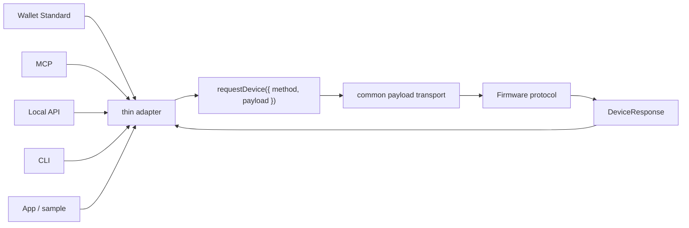
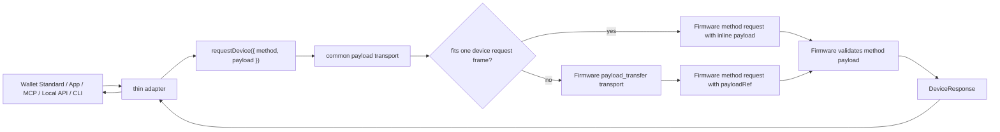

# Agent-Q Communication Protocol

This document defines the communication contract between the Agent-Q host
process and Agent-Q Firmware.

This document is a protocol specification, not an implementation-status report.
Tracked implementation status and hardware verification live in the repository
status documents and test evidence.

Agent-Q separates request surfaces from signing authority. External callers are
request sources. Firmware is the authority for device state, policy state,
device-local approval, signing, persistence, and failure cleanup.

## Single Device Request Contract

All host-to-Firmware product requests use one request envelope,
`DeviceRequest`, and one response envelope, `DeviceResponse`.

The contract-level sources of truth are:

- method identity;
- payload carrier;
- response envelope;
- result carrier;
- public failure code.

Method-specific payload and result shapes are named by the `DeviceMethod` table.
Method rows do not own transport choice, payload-size routing, delivery
capability, public error wording, or public helper names.

Successful responses use `success: true` and `result`. Failed responses use
`success: false` and `error`. Direct/upload delivery is internal to the host and
Firmware transport and is not visible to adapters.

## Adapter Boundary

External entrypoints remain adapters:

- Wallet Standard;
- MCP tools;
- local HTTP API;
- CLI;
- sample apps and app-web.

Each adapter converts its external standard shape into:

```ts
requestDevice({ method, payload })
```

The adapter converts the normalized `DeviceResponse` into the shape required by
that external standard. Adapters do not decide direct/upload, classify
payload-size errors, inspect Firmware upload capabilities, or construct upload
descriptors.





## DeviceRequest

`DeviceRequest` is the only product request envelope sent by `requestDevice`.

```ts
type DeviceRequest = {
  id: string;
  version: 1;
  sessionId?: string;
  method: DeviceMethod;
  payload?: unknown;
};
```

| Field | Required | Type | Owner | Rule |
| --- | --- | --- | --- | --- |
| `id` | yes | safe request id string | caller creates; Core validates | Echoed by response when parseable. |
| `version` | yes | current protocol version | Core/Firmware protocol | Unsupported version returns `unsupported_version`. |
| `sessionId` | method-dependent | session id string | session owner | Required only for methods marked session-required in the method table. Forbidden for methods marked no-session. |
| `method` | yes | `DeviceMethod` | protocol contract | Only values in the method table are accepted. Unknown values return `unsupported_method`. |
| `payload` | method-dependent | method payload object or omitted | method schema owner | Presence follows the method table. |

`id` is correlation only. A method that targets another request, such as
`get_result` or `ack_result`, carries the target request id inside `payload` as
`retainedRequestId`.

## DeviceResponse

`DeviceResponse` is the only product response envelope returned by Firmware to
`requestDevice`.

```ts
type DeviceResponse =
  | {
      id?: string;
      version: 1;
      success: true;
      method: DeviceMethod;
      result: unknown;
    }
  | {
      id?: string;
      version: 1;
      success: false;
      method?: DeviceMethod;
      error: {
        code: DeviceErrorCode;
        message: string;
        retryable: boolean;
      };
    };
```

| Field | Success | Failure | Type | Rule |
| --- | --- | --- | --- | --- |
| `id` | present when request id was parseable | present when request id was parseable | safe request id string | Never invented after an unparseable id. |
| `version` | yes | yes | current protocol version | Response version is the responder's current protocol version. |
| `success` | `true` | `false` | boolean | Determines whether `result` or `error` is present. |
| `method` | yes | present when request method was parseable | `DeviceMethod` | Never invented after an unparseable method. |
| `result` | yes | forbidden | method result object | Parsed by the caller according to `method`. |
| `error` | forbidden | yes | normalized error object | Contains canonical code, message, and retryable flag. |

The failure `error` object is:

| Field | Type | Rule |
| --- | --- | --- |
| `code` | `DeviceErrorCode` | Fixed by the single public error table. |
| `message` | string | Fixed by `DeviceErrorCode`; adapters and Firmware handlers do not author user-visible text. |
| `retryable` | boolean | Fixed by `DeviceErrorCode`; adapters do not override it. |

Method-specific success status fields are allowed only inside `result` when
`success=true`. Rejection, timeout, unsupported state, payload failure, signing
failure, and policy rejection are top-level failed outcomes.

## DeviceErrorCode

`DeviceErrorCode` is the only user-visible failure code source of truth.
Successful responses do not have a code.

| Code | Retryable | Fixed message | Meaning |
| --- | --- | --- | --- |
| `invalid_request` | false | Device request is malformed. | Envelope, JSON, id, version, or method shape is invalid. |
| `invalid_params` | false | Device request payload is invalid. | Method payload shape or value is invalid. |
| `invalid_state` | false | Device state does not allow this request. | Firmware state does not allow the method. |
| `invalid_session` | false | Session is missing, expired, or does not match. | Session is missing, expired, or does not match. |
| `request_id_conflict` | false | Request id is already bound to a different request. | Request id is already bound to a different retained request identity. |
| `unknown_request` | false | Requested retained response does not exist. | Requested retained response does not exist in the current session. |
| `no_active_device` | false | No active device is configured. | Host process has no selected active device for the requested scope. |
| `device_not_found` | true | Requested device is not known to Agent-Q. | Host process cannot find the requested stored device. |
| `invalid_device_id` | false | Device id is invalid. | Host-side device id input is invalid. |
| `invalid_device` | false | Device identity is unsafe. | Host process rejected a device identity as unsafe. |
| `device_mismatch` | false | Connected device does not match the requested device. | Host process connected to a device whose Firmware identity did not match the requested device id. |
| `unsupported_method` | false | Device method is not supported. | Method is not implemented by this Firmware or host boundary. |
| `unsupported_version` | false | Protocol version is not supported. | Protocol version is not supported. |
| `unsupported_chain` | false | Chain is not supported. | Chain is not supported for the method. |
| `unsupported_transaction` | false | Transaction shape is not supported. | Transaction shape is not supported by the current signing path. |
| `malformed_transaction` | false | Transaction bytes are malformed. | Transaction bytes or transaction structure are malformed. |
| `payload_too_large` | false | Payload exceeds the current device payload capacity. | Payload exceeds the current device payload capacity. |
| `payload_unavailable` | false | Referenced payload is unavailable. | Referenced internal payload is missing, expired, consumed, or wrong-session. |
| `payload_conflict` | true | Another sensitive request blocks this payload. | Another payload or sensitive flow blocks this request. |
| `busy` | true | Device is busy with another request. | Device is already handling another request. |
| `timeout` | true | The signing request timed out on the device. | Device or user action timed out. |
| `user_rejected` | false | The signing request was rejected on the device. | Device-local user confirmation rejected the request. |
| `policy_rejected` | false | The signing request was rejected by device policy. | Firmware policy rejected the request. |
| `signing_failed` | false | The device could not produce a signature. | Firmware could not produce the requested signature. |
| `ui_error` | false | Device could not display or manage required UI. | Firmware could not display or manage required device UI. |
| `auth_unavailable` | false | Device-local authentication verifier is unavailable. | Device-local authentication verifier is unavailable. |
| `account_unavailable` | false | Device account material is unavailable or does not match the request. | Device account material is unavailable or does not match the request. |
| `policy_unavailable` | false | Firmware policy store or active policy is unavailable. | Firmware policy store or active policy is unavailable. |
| `history_unavailable` | false | Approval history is unavailable. | Approval history is unavailable. |
| `rng_unavailable` | true | Device random generator is unavailable. | Firmware random generator is unavailable. |
| `invalid_response` | true | Device response is malformed. | Firmware response JSON, envelope, or method result shape is invalid. |
| `handshake_failed` | true | Device status or identification handshake failed. | Device status or identification handshake failed. |
| `port_not_found` | true | Requested device port is not connected. | Requested device port is not connected. |
| `port_in_use` | true | Requested device port is already in use. | Requested device port is already in use. |
| `port_permission_denied` | false | Host process lacks permission to access the device port. | Host process lacks permission to access the device port. |
| `unsupported_transport` | false | Host environment does not support the required device transport. | Host environment does not provide the transport required by the adapter. |
| `transport_closed` | true | Device connection closed before a valid response. | Established host-device connection closed before a valid response. |
| `transport_error` | true | Host-device transport failed before a valid response. | Host-device transport failed before a valid device response was received. |
| `local_server_unavailable` | true | Local Agent-Q server is unavailable. | Local CLI client cannot reach the local Agent-Q server. |
| `identification_code_exhausted` | true | Identification code could not be allocated. | Host process could not allocate a unique identification code. |
| `internal_output_error` | false | Agent-Q produced an unexpected internal result. | Output sanitization or internal result validation failed. |
| `unknown_error` | false | Agent-Q request failed. | Failure did not match a known public code. |

Rules:

- Every code in this table is a failure code used as `error.code`.
- Every failure code has exactly one fixed message.
- Every failure code has exactly one fixed retryable value.
- Method handlers, adapters, providers, CLI, MCP, local HTTP, and Firmware
  response writers select only an error code. They do not author public text.
- Firmware local result enums are internal only. Every public failure maps
  through this table before leaving a boundary.
- Any unmapped error becomes `unknown_error`.

## DeviceMethod

`DeviceMethod` is the only product method table. Adding a device method means
adding one row here and then implementing that row through the same
`DeviceRequest` and `DeviceResponse` contract.

| Method | Session rule | Payload rule | Payload schema owner | Result schema owner | Firmware gate |
| --- | --- | --- | --- | --- | --- |
| `get_status` | forbidden | forbidden | no payload | `StatusResult` object: device status and provisioning status | Firmware status/material consistency refresh gate. |
| `identify_device` | forbidden | required | `IdentifyDevicePayload` object: `{ code }` | `IdentifyDeviceResult` object: displayed code and device status | Firmware identification display gate. |
| `connect` | forbidden | required | `ConnectPayload` object: `{ clientName }` | `ConnectResult` object: session id, session TTL, and device status | Provisioned material, active policy, local authentication verifier, and Firmware-owned device-local approval gate. |
| `disconnect` | required | forbidden | no payload | `DisconnectResult` object: `{}` | Active session cleanup gate. |
| `get_capabilities` | required | forbidden | no payload | `CapabilitiesResult` object: chains, accounts, methods, signing state, and credential support | Active session and provisioned material gate. |
| `get_accounts` | required | forbidden | no payload | `AccountsResult` object: public accounts | Active session and account-material gate. |
| `policy_get` | required | forbidden | no payload | `PolicyGetResult` object: active policy document | Active session and policy-store gate. |
| `get_approval_history` | required | required | `ApprovalHistoryPayload` object: `{ limit, beforeSeq? }` | `ApprovalHistoryResult` object: records and `hasMore` | Active session and approval-history store gate. |
| `sign_transaction` | required | required | `SuiSignTransactionPayload` object: `{ chain, network, txBytes }` after payload resolution | `SignTransactionResult` object: signature metadata for signed result | Active session, account binding, device-local signing mode, policy or device-confirmation signing gate. |
| `sign_personal_message` | required | required | `SuiSignPersonalMessagePayload` object: `{ chain, network, message }` after payload resolution | `SignPersonalMessageResult` object: signature and message bytes for signed result | Active session, account binding, user-confirmed signing gate; policy mode fails closed. |
| `policy_propose` | required | required | `PolicyProposePayload` object: `{ policy }` after payload resolution | `PolicyProposalOutcome` object: applied/rejected/timed-out/storage result and policy summary when available | Active session, policy parser, device-local policy review, local authentication, and policy-store commit gate. |
| `credential_prepare` | required | required | `CredentialPreparePayload` object: `{ chain, credential }` | `CredentialPreparation` object: public key and derived address preparation | Active session and credential preparation gate. |
| `credential_propose` | required | required | `CredentialProposePayload` object: `{ chain, credential, network, address, publicKey, maxEpoch, inputs }` after payload resolution | `CredentialProposalOutcome` object: activated/rejected/timed-out/storage result and session-ended flag | Active session, proof parser, device-local credential review, local authentication, and credential-store commit gate. |
| `get_result` | required | required | `RetainedResponsePayload` object: `{ retainedRequestId }` | method response object retained for `retainedRequestId` | Active session and retained-response lookup gate. |
| `ack_result` | required | required | `RetainedResponsePayload` object: `{ retainedRequestId }` | `AckResult` object: `{}` | Active session and retained-response cleanup gate. |

`Session rule` values are exactly `forbidden`, `required`, or `optional`.
`Payload rule` values are exactly `forbidden`, `required`, or `optional`.

## Payload Transport

Direct/upload is an internal transport strategy under `requestDevice`.

| Boundary | Allowed to choose direct/upload | Allowed to know upload descriptor | Allowed to validate method payload | Rule |
| --- | --- | --- | --- | --- |
| adapter | no | no | no | Converts external input to `requestDevice` only. |
| `requestDevice` | yes | yes, internally | no | Chooses transport and sends device request. |
| payload store | no | yes | no | Owns payload descriptor metadata. |
| method handler | no | no | yes | Receives resolved method payload only. |

Rules:

- No adapter code measures payload size to choose direct/upload.
- No method-specific code measures payload size to choose direct/upload.
- No method payload echoes `payloadKind`, `sizeBytes`, or `payloadDigest`.
- Any internal `payloadRef` is resolved before method validation.
- Public capabilities do not expose `inlineMaxBytes`, `chunkMaxBytes`,
  `payloadMaxBytes`, `payloadKind`, `sizeBytes`, or `payloadDigest` as adapter
  decision inputs.

Required transport flow:

```text
adapter -> requestDevice({ method, payload })
requestDevice -> common payload transport
common payload transport -> direct frame or upload frames
Firmware -> method handler after payload resolution
```

Forbidden transport flow:

```text
adapter/method code -> measure size -> choose direct/upload -> build descriptor
```

`payload_transfer` is the only host-Firmware payload transfer operation used by
`requestDevice`. It is not an app, MCP, Wallet Standard, local HTTP, or CLI
method. It is not a `DeviceMethod`.

`payload_transfer` is a closed discriminated transport request. Each action has
one exact field list. Fields for another action are invalid input. Product
method handlers never receive the action object.

| Action | Exact fields | Success result |
| --- | --- | --- |
| `begin` | `id`, `version`, `type: "payload_transfer"`, `action: "begin"`, `sessionId`, `totalBytes`, `payloadDigest` | `{ transferId, receivedBytes, chunkMaxBytes }` |
| `chunk` | `id`, `version`, `type: "payload_transfer"`, `action: "chunk"`, `sessionId`, `transferId`, `offsetBytes`, `chunk` | `{ receivedBytes }` |
| `finish` | `id`, `version`, `type: "payload_transfer"`, `action: "finish"`, `sessionId`, `transferId` | `{ payloadRef }` |
| `abort` | `id`, `version`, `type: "payload_transfer"`, `action: "abort"`, `sessionId`, `transferId` | `{}` |

`payloadDigest` is the SHA-256 digest of the raw payload bytes received by the
payload store. It is transport metadata only. The method request that consumes a
finalized payload carries only the internal `payloadRef` until Firmware resolves
it to the method payload bytes before method validation.

## External Surface Mapping

Existing external surfaces remain external standards. They do not become device
protocol methods.

| External surface | Existing exposed operation | Adapter payload built | DeviceMethod | Adapter result |
| --- | --- | --- | --- | --- |
| Wallet Standard | connect feature | `ConnectPayload` | `connect` | Wallet Standard account/connect result |
| Wallet Standard | disconnect feature | no payload | `disconnect` | Wallet Standard disconnect result |
| Wallet Standard | account/capability read through provider | no payload | `get_capabilities`, `get_accounts` | Wallet account and feature projection |
| Wallet Standard | `sui:signTransaction` | `SuiSignTransactionPayload` | `sign_transaction` | Wallet Standard signed transaction result |
| Wallet Standard | `sui:signPersonalMessage` | `SuiSignPersonalMessagePayload` | `sign_personal_message` | Wallet Standard personal-message signature result |
| MCP | `scan_devices` | no device request payload | host status scan using `get_status` | MCP scan result |
| MCP | `identify_devices` | `IdentifyDevicePayload` per live candidate | `identify_device` | MCP identify result |
| MCP | `select_device`, `list_devices`, `set_device_metadata`, `get_device_status` | host process metadata/status input | host-only operation or `get_status` where live status is required | MCP host result |
| MCP | `connect_device` | `ConnectPayload` | `connect` | MCP connect result |
| MCP | `disconnect_device` | no payload | `disconnect` | MCP disconnect result |
| MCP | `get_capabilities` | no payload | `get_capabilities` | MCP capabilities result |
| MCP | `get_accounts` | no payload | `get_accounts` | MCP accounts result |
| MCP | `policy_get` | no payload | `policy_get` | MCP policy result |
| MCP | `get_approval_history` | `ApprovalHistoryPayload` | `get_approval_history` | MCP approval-history result |
| MCP | `sign_transaction` | `SuiSignTransactionPayload` | `sign_transaction` | MCP signing outcome |
| MCP | `sign_personal_message` | `SuiSignPersonalMessagePayload` | `sign_personal_message` | MCP personal-message signing outcome |
| MCP | `policy_propose` | `PolicyProposePayload` | `policy_propose` | MCP policy proposal outcome |
| local HTTP API | `/api/connect` | `ConnectPayload` | `connect` | `{ ok: true, result }` or `{ ok: false, error }` |
| local HTTP API | `/api/disconnect` | no payload | `disconnect` | `{ ok: true, result }` or `{ ok: false, error }` |
| local HTTP API | `/api/get_accounts` | no payload | `get_accounts` | `{ ok: true, result }` or `{ ok: false, error }` |
| local HTTP API | `/api/sign_transaction` | `SuiSignTransactionPayload` | `sign_transaction` | `{ ok: true, result }` or `{ ok: false, error }` |
| local HTTP API | `/api/policy_get` | no payload | `policy_get` | `{ ok: true, result }` or `{ ok: false, error }` |
| local HTTP API | `/api/get_approval_history` | `ApprovalHistoryPayload` | `get_approval_history` | `{ ok: true, result }` or `{ ok: false, error }` |
| local HTTP API | `/api/policy_template_minimal_sui_testnet` | no device request payload | host-only operation | local HTTP template result |
| local HTTP API | `/api/policy_propose` | `PolicyProposePayload` | `policy_propose` | `{ ok: true, result }` or `{ ok: false, error }` |
| CLI | `agent-q serve --request-connect` | `ConnectPayload` | `connect` | stderr diagnostic and process status |
| CLI | `agent-q-sui-signer configure` | account/capability read payloads | `connect`, `get_accounts`, `disconnect` | CLI signer configuration output |
| CLI | `agent-q-sui-signer` sign request | `SuiSignTransactionPayload` | `connect`, `sign_transaction`, `disconnect` | Sui external signer JSON-RPC result |
| sample apps and app-web | provider or local API calls | adapter-specific payload converted by provider/local API | method selected by adapter | app-specific UI result |

Rows must not introduce a new external operation for upload, direct payloads,
uploaded payloads, or payload references.

## Exposure Reduction Requirements

The single device request contract is incomplete while any exposed surface
bypasses `requestDevice`.

Required audit surfaces:

- package exports;
- protocol builders;
- provider entrypoints;
- Wallet Standard features;
- MCP tools;
- local HTTP routes;
- CLI commands;
- sample/app-web calls;
- Firmware USB operation handlers;
- Firmware response writers;
- tests that encode public request/response shape.

Final dispositions for existing surfaces are:

- `adapter over requestDevice`;
- `internal only`;
- `removed from public export`;
- `method row inside DeviceMethod`;
- `unchanged external standard wrapper`.

Package exports must not expose payload transport primitives, payload
references, direct/upload helpers, direct/upload constants, or request builders
that expose payload transport as public product API. Internal transport code
remains reachable only from `requestDevice` and Firmware transport handlers.

No raw device, OS, serial, Firmware, parser, or unexpected error message leaves
an output boundary. Output boundaries choose one `DeviceErrorCode`; the fixed
message and retryable flag come from the single public error table.
